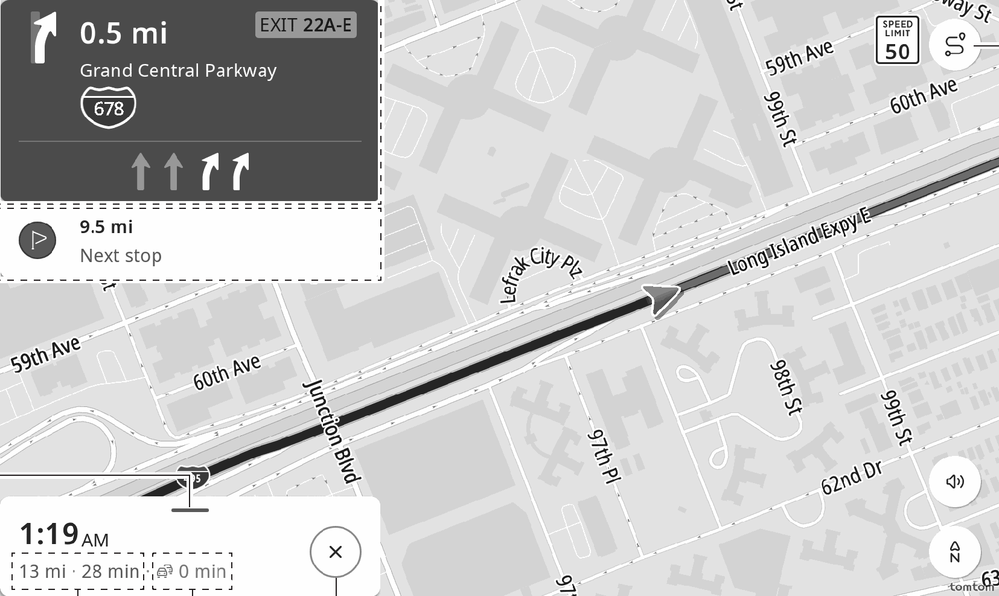

<!-- GENERATED:START function=9fa584252787 (generated; edits inside this block are overwritten by the next publish — write your own notes outside it) -->
# 18. Route guidance screen

<b>Function path:</b> Navigation (if equipped) / Route guidance screen <b>Source:</b> printed page 133, 134 <b>Test-ready:</b> no — procedure missing or thresholds unfilled

Every "Presumed requirement" row below is machine-derived from the Owner's Manual text by rule-based extraction — not AI-written — and traceable to the printed page in its Source column.

## Figures (areas of the original PDF; the OM has no figure numbers or captions)

- Figure 18-1 source: p.133
- (Copied from OM) Next guidance display

## 18-2-1. Service overview

| # | Presumed requirement | Strength | Source |
|---|---|---|---|
| 1 | Route guidance screenDuring route guidance, various types of guidance screens can be displayed depending on conditions. | capability | p.133 / text |
| 2 | Route guidance screenIt is also possible during route guidance to add new waypoint(s) or change calculation conditions to guide another route. | capability | p.133 / text |
| 3 | Route guidance screenNext guidance display Displays the next street name, distance to the next turn, and an arrow indicating the turning direction. | capability | p.133 / text |
| 4 | Route guidance screenDistance up to the next waypoint Select to display the address and expected arrival time. | capability | p.133 / text |

## 18-2-2. Service requirements

| # | Presumed requirement | Strength | Source |
|---|---|---|---|
| 1 | Step -“Remove stop”: Select to delete the next waypoint from the route. | capability | p.133 / bullet |
| 2 | Route guidance screenSelect to display the following items:. | capability | p.134 / text |
| 3 | Step -“Add stop”: Select to add a waypoint. (→P.126) Search for the desired waypoint on the search screen and then touch “Add stop”. | capability | p.134 / bullet |
| 4 | Step -“Route options”: Select to change calculation conditions/points to be avoided to change the guided current route. (→P.131). | capability | p.134 / bullet |
| 5 | Step -“Settings”: Select to change the navigation settings. (→P.135). | capability | p.134 / bullet |
| 6 | Route guidance screenDisplays expected time and distance to the destination. | capability | p.134 / text |
| 7 | Route guidance screenDisplays time to be increased/decreased by taking the most recent traffic information into account. | capability | p.134 / text |
| 8 | Route guidance screenSelect to end route guidance. | capability | p.134 / text |
| 9 | Route guidance screenSelect to display a list of route details up to the destination, along with a map of overall route. | capability | p.134 / text |
| 10 | Step -If a destination that is not located on a road is set, the vehicle will be guided to the point on a road nearest to the destination. The road nearest to the selected point is set as the destination. | capability | p.134 / bullet |

## 18-5. Exception operation

| # | Presumed requirement | Strength | Source |
|---|---|---|---|
| 1 | Step -Be sure to obey traffic regulations and keep road conditions in mind while driving. If a traffic sign on the road has been changed, the route guidance may not indicate such changed information. | constraint | p.134 / bullet |
| 2 | Step -The route for returning may not be the same as that for going. | capability | p.134 / bullet |
| 3 | Step -The route guidance to the destination may not be the shortest route or a route without traffic congestion. | capability | p.134 / bullet |
| 4 | Step -Route guidance may not be available if there is no road data for the specified location. | constraint | p.134 / bullet |
<!-- GENERATED:END function=9fa584252787 -->

