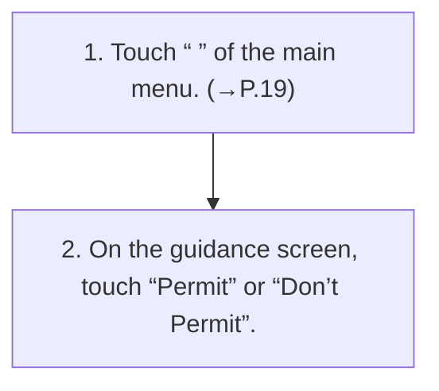

<!-- GENERATED:START function=e351d85cb050 (generated; edits inside this block are overwritten by the next publish — write your own notes outside it) -->
# 2. Starting the navigation system

<b>Function path:</b> Navigation (if equipped) / Starting the navigation system <b>Source:</b> printed page 119 <b>Test-ready:</b> yes — no unfilled thresholds and a procedure is present

Every "Presumed requirement" row below is machine-derived from the Owner's Manual text by rule-based extraction — not AI-written — and traceable to the printed page in its Source column.

## Procedure

| Seq | Step | Operation (Copied from OM) | Source |
|---|---|---|---|
| 1 | 1 | Touch “ ” of the main menu. (→P.19) | p.119 / step |
| 2 | 2 | On the guidance screen, touch “Permit” or “Don’t Permit”. | p.119 / step |

## 2-2-2. Service requirements

| # | Presumed requirement | Strength | Source |
|---|---|---|---|
| 1 | Step -When the subscription to the services using the cloud navigation server is not valid, a screen (subscription guidance) will be displayed. Follow the guidance screen. | capability | p.119 / bullet |
| 2 | Step -After touching “Don’t Permit” on the guidance screen, if the use of the service linked to the cloud navigation server is desired, enable the setting to share the current vehicle position on the “Location Based Cloud Services” item of the software settings screen. (→P.48). | constraint | p.119 / bullet |

## 2-5. Exception operation

| # | Presumed requirement | Strength | Source |
|---|---|---|---|
| 1 | Step -When “Don’t Permit” is selected on the guidance screen, functions using the cloud navigation server cannot be used. Functions using the system’s data only are available. | constraint | p.119 / bullet |
<!-- GENERATED:END function=e351d85cb050 -->

