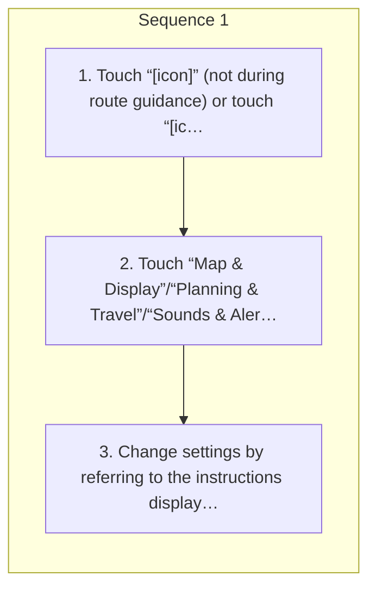

<!-- GENERATED:START function=2c760f89ec53 (generated; edits inside this block are overwritten by the next publish — write your own notes outside it) -->
# 20. Navigation settings screen

<b>Function path:</b> Navigation (if equipped) / Navigation settings screen <b>Source:</b> printed page 135 <b>Test-ready:</b> yes — no unfilled thresholds and a procedure is present

Every "Presumed requirement" row below is machine-derived from the Owner's Manual text by rule-based extraction — not AI-written — and traceable to the printed page in its Source column.

## Procedure

| Seq | Step | Operation (Copied from OM) | Source |
|---|---|---|---|
| 1 | 1 | Touch “[icon]” (not during route guidance) or touch “[icon]” and then touch | p.135 / step |
| 1 | 2 | Touch “Map &amp; Display”/“Planning &amp; Travel”/“Sounds &amp; Alerts”/“Privacy &amp; Data”. | p.135 / step |
| 1 | 3 | Change settings by referring to the instructions displayed. | p.135 / step |

## 20-2-1. Service overview

| # | Presumed requirement | Strength | Source |
|---|---|---|---|
| 1 | Navigation settings screen“Settings” (during route guidance). | capability | p.135 / text |
<!-- GENERATED:END function=2c760f89ec53 -->

