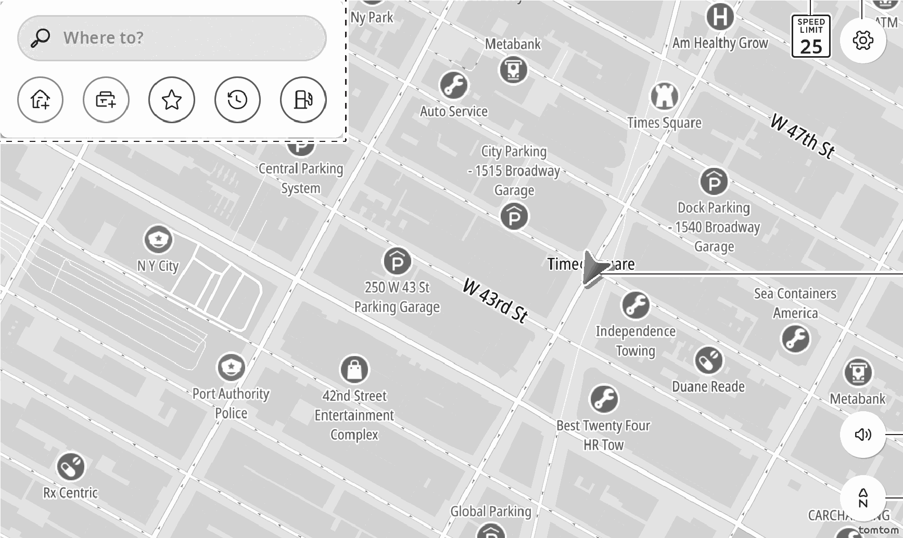
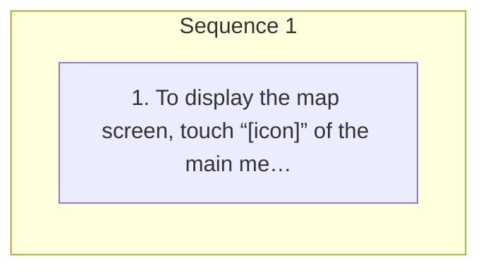

<!-- GENERATED:START function=9aad734301de (generated; edits inside this block are overwritten by the next publish — write your own notes outside it) -->
# 3. Map screen overview

<b>Function path:</b> Navigation (if equipped) / Map screen overview <b>Source:</b> printed page 119, 120 <b>Test-ready:</b> yes — no unfilled thresholds and a procedure is present

Every "Presumed requirement" row below is machine-derived from the Owner's Manual text by rule-based extraction — not AI-written — and traceable to the printed page in its Source column.

## Figures (areas of the original PDF; the OM has no figure numbers or captions)

- Figure 3-1 source: p.119
- (Copied from OM) To display the map screen, touch “[icon]” of the main menu.

## Procedure

| Seq | Step | Operation (Copied from OM) | Source |
|---|---|---|---|
| 1 | 1 | To display the map screen, touch “[icon]” of the main menu. (→P.19) | p.119 / step |

## 3-2-1. Service overview

| # | Presumed requirement | Strength | Source |
|---|---|---|---|
| 1 | Map screen overviewNavigation menu (→P.125). | capability | p.120 / text |
| 2 | Map screen overviewDisplays the speed limit for the road currently being traveled on. | capability | p.120 / text |
| 3 | Map screen overviewSelect to display the navigation settings screen. (→P.135). | capability | p.120 / text |
| 4 | Map screen overviewDisplays the current vehicle position. | capability | p.120 / text |
| 5 | Map screen overviewSelect to set a voice guidance. | capability | p.120 / text |

## 3-2-2. Service requirements

| # | Presumed requirement | Strength | Source |
|---|---|---|---|
| 1 | Step -“Unmuted”: Enables voice guidance. | capability | p.120 / bullet |
| 2 | Step -“Alerts only”: Enables the voice guidance of alerts only. | capability | p.120 / bullet |
| 3 | Step -“Muted”: Disables voice guidance. | capability | p.120 / bullet |
| 4 | Map screen overviewSelect to change the map display mode between 2D north-up, 2D heading-up, or 3D heading-up. (→P.121). | capability | p.120 / text |
| 5 | Step -The speed limit is displayed only when information is available in the map data. | constraint | p.120 / bullet |
<!-- GENERATED:END function=9aad734301de -->

