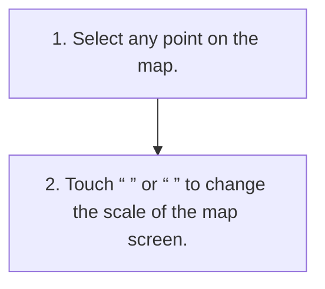

<!-- GENERATED:START function=d9c117bedad6 (generated; edits inside this block are overwritten by the next publish — write your own notes outside it) -->
# 6. Map scale

<b>Function path:</b> Navigation (if equipped) / Map scale <b>Source:</b> printed page 121 <b>Test-ready:</b> yes — no unfilled thresholds and a procedure is present

Every "Presumed requirement" row below is machine-derived from the Owner's Manual text by rule-based extraction — not AI-written — and traceable to the printed page in its Source column.

## Procedure

| Seq | Step | Operation (Copied from OM) | Source |
|---|---|---|---|
| 1 | 1 | Select any point on the map. | p.121 / step |
| 2 | 2 | Touch “ ” or “ ” to change the scale of the map screen. | p.121 / step |

## 6-2-2. Service requirements

| # | Presumed requirement | Strength | Source |
|---|---|---|---|
| 1 | Step -During route guidance, the map is zoomed in automatically when approaching intersections or turning points. | constraint | p.121 / bullet |
| 2 | Step -The scale of the map screen can also be changed with the double touch or pinch operation. (→P.24). | capability | p.121 / bullet |
| 3 | Step -If the map scale has been changed after moving the map, the map scale will return to previous scale when the map is returned to the current position. | constraint | p.121 / bullet |

## 6-5. Exception operation

| # | Presumed requirement | Strength | Source |
|---|---|---|---|
| 1 | Step -If the map scale is adjusted manually during route guidance, the map may not be zoomed in automatically. To reenable the automatic zoom function, touch “Re-center” or change the orientation of the map screen. (→P.121). | capability | p.121 / bullet |
<!-- GENERATED:END function=d9c117bedad6 -->

