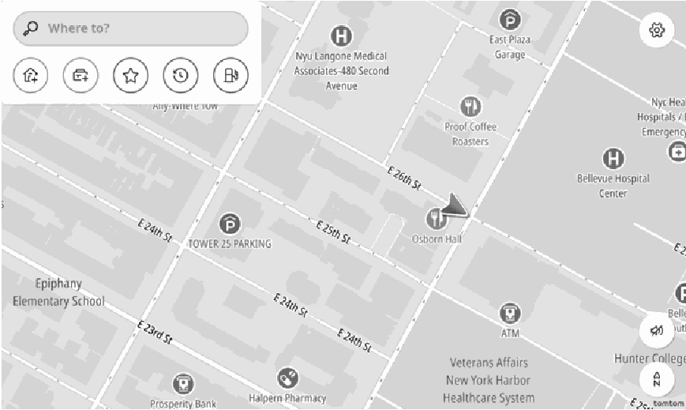
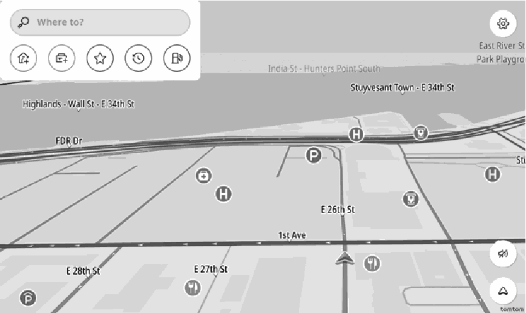
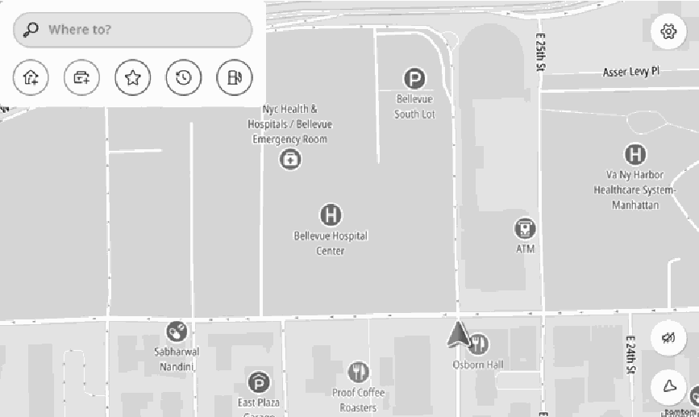
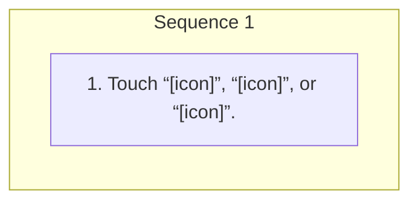

<!-- GENERATED:START function=f07b78057f98 (generated; edits inside this block are overwritten by the next publish — write your own notes outside it) -->
# 7. Orientation of the map

<b>Function path:</b> Navigation (if equipped) / Orientation of the map <b>Source:</b> printed page 121, 122 <b>Test-ready:</b> yes — no unfilled thresholds and a procedure is present

Every "Presumed requirement" row below is machine-derived from the Owner's Manual text by rule-based extraction — not AI-written — and traceable to the printed page in its Source column.

## Figures (areas of the original PDF; the OM has no figure numbers or captions)

- Figure 7-1 source: p.121
- (Copied from OM) ● Regardless of the direction of vehicle travel, north is always up.

- Figure 7-2 source: p.122
- (Copied from OM) ● The direction of vehicle travel is always up.

- Figure 7-3 source: p.122
- (Copied from OM) ● The direction of vehicle travel is always up.

## Procedure

| Seq | Step | Operation (Copied from OM) | Source |
|---|---|---|---|
| 1 | 1 | Touch “[icon]”, “[icon]”, or “[icon]”. | p.121 / step |

## 7-2-1. Service overview

| # | Presumed requirement | Strength | Source |
|---|---|---|---|
| 1 | Orientation of the mapThe orientation of the map can be changed between 2D north-up, 2D heading-up, and 3D heading-up. | capability | p.121 / text |

## 7-2-2. Service requirements

| # | Presumed requirement | Strength | Source |
|---|---|---|---|
| 1 | Step -Each time the symbol is selected, the orientation of the map changes. | capability | p.121 / bullet |
| 2 | Orientation of the map2D north-up 6. | capability | p.121 / text |
| 3 | Step -Regardless of the direction of vehicle travel, north is always up. | capability | p.121 / bullet |
| 4 | Orientation of the map3D heading-up. | capability | p.122 / text |
| 5 | Step -The direction of vehicle travel is always up. | capability | p.122 / bullet |
| 6 | Orientation of the map2D heading-up. | capability | p.122 / text |
| 7 | Step -The direction of vehicle travel is always up. | capability | p.122 / bullet |
<!-- GENERATED:END function=f07b78057f98 -->

