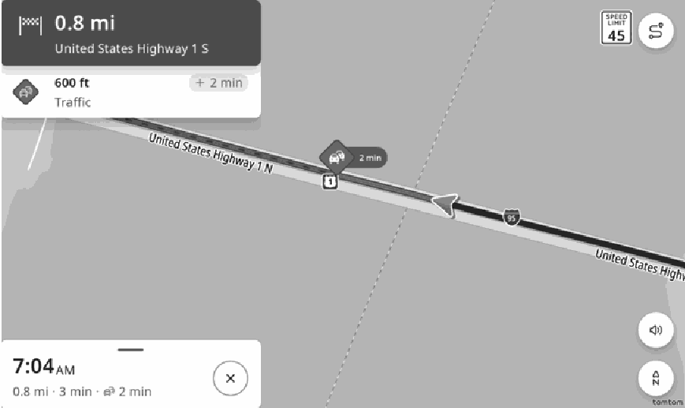

<!-- GENERATED:START function=d66270745b8c (generated; edits inside this block are overwritten by the next publish — write your own notes outside it) -->
# 8. Traffic information

<b>Function path:</b> Navigation (if equipped) / Traffic information <b>Source:</b> printed page 122, 123 <b>Test-ready:</b> no — procedure missing or thresholds unfilled

Every "Presumed requirement" row below is machine-derived from the Owner's Manual text by rule-based extraction — not AI-written — and traceable to the printed page in its Source column.

## Figures (areas of the original PDF; the OM has no figure numbers or captions)

- Figure 8-1 source: p.123
- (Copied from OM) ● To display traffic information for the area around your vehicle on the map, it is necessary to

## 8-2-1. Service overview

| # | Presumed requirement | Strength | Source |
|---|---|---|---|
| 1 | Traffic informationRoad sections affected by traffic conditions are displayed in a different color on the map, and a small icon representing the type of traffic condition is displayed above the road. | capability | p.122 / text |
| 2 | Traffic informationThis feature is available at certain map scales. | capability | p.122 / text |
| 3 | Traffic informationTo allow the system to receive traffic information, it is necessary to subscribe to the service. (→P.118). | capability | p.122 / text |

## 8-2-2. Service requirements

| # | Presumed requirement | Strength | Source |
|---|---|---|---|
| 1 | Step -To display traffic information for the area around your vehicle on the map, it is necessary to enable the setting to send your vehicle location to the cloud navigation server. (→P.48). | capability | p.123 / bullet |

## 8-5. Exception operation

| # | Presumed requirement | Strength | Source |
|---|---|---|---|
| 1 | Step -In situations where DCM (Data Communication Module) communication cannot be established, it is not possible to receive traffic information. Also, in areas of weak communication signals, it may not be possible to receive traffic information. To receive traffic information, move the vehicle to an area where communication signals can be received normally. | constraint | p.123 / bullet |
| 2 | Step -The traffic information displaying function may not be available depending on country and vehicle. | capability | p.123 / bullet |
<!-- GENERATED:END function=d66270745b8c -->

