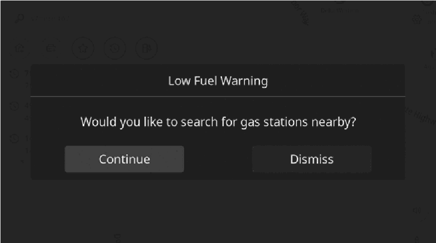
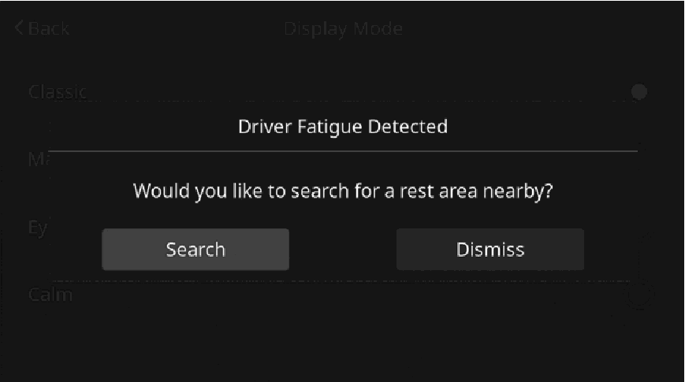

<!-- GENERATED:START function=2d72f3019460 (generated; edits inside this block are overwritten by the next publish — write your own notes outside it) -->
# 9. Other information

<b>Function path:</b> Navigation (if equipped) / Other information <b>Source:</b> printed page 123, 124 <b>Test-ready:</b> no — procedure missing or thresholds unfilled

Every "Presumed requirement" row below is machine-derived from the Owner's Manual text by rule-based extraction — not AI-written — and traceable to the printed page in its Source column.

## Figures (areas of the original PDF; the OM has no figure numbers or captions)

- Figure 9-1 source: p.123
- (Copied from OM) ● “Continue”: Select to search for gas stations.

- Figure 9-2 source: p.124
- (Copied from OM) ● “Search”: Select to search for rest areas.

## 9-2-1. Service overview

| # | Presumed requirement | Strength | Source |
|---|---|---|---|
| 1 | Other informationLow fuel warning 6. | capability | p.123 / text |
| 2 | Other informationWhen the fuel level is low, a warning message will pop up on the screen. | capability | p.123 / text |

## 9-2-2. Service requirements

| # | Presumed requirement | Strength | Source |
|---|---|---|---|
| 1 | Step -“Continue”: Select to search for gas stations. | capability | p.123 / bullet |
| 2 | Step -“Dismiss”: Select to delete the message. | capability | p.123 / bullet |
| 3 | Other informationPeriodic rest notification. | capability | p.124 / text |
| 4 | Other informationIf the system determines, based on the driver’s condition, that a rest may be necessary, a pop-up message will be displayed on the screen. | capability | p.124 / text |
| 5 | Step -“Search”: Select to search for rest areas. | capability | p.124 / bullet |
| 6 | Step -“Dismiss”: Select to delete the message. | capability | p.124 / bullet |
<!-- GENERATED:END function=2d72f3019460 -->

