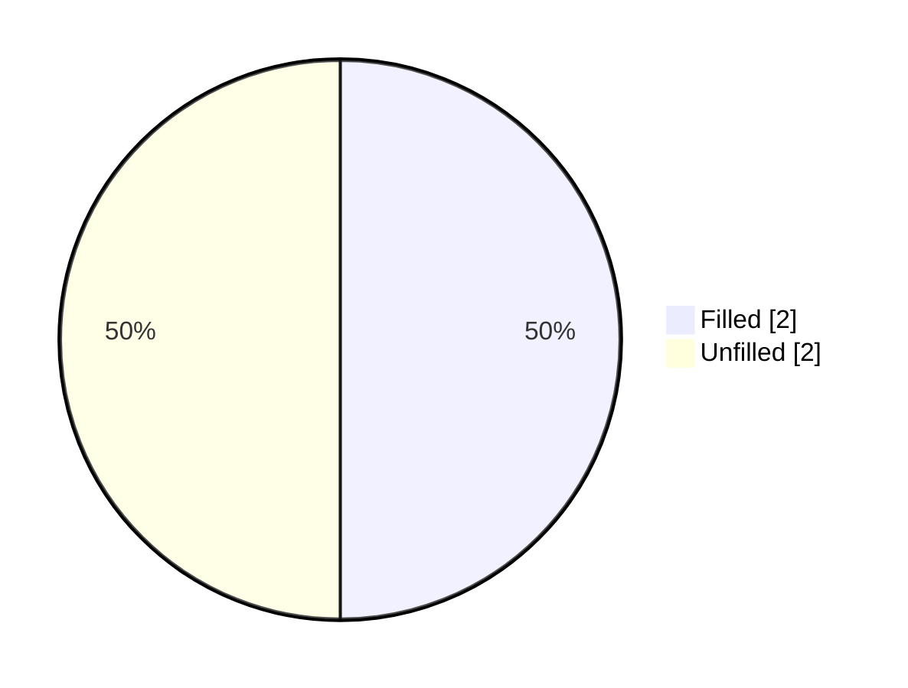
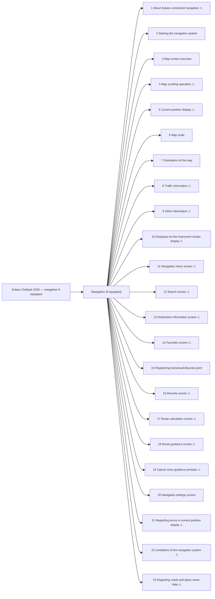

<!-- GENERATED:START index (generated; edits inside this block are overwritten by the next publish — write your own notes outside it) -->
# Subaru Outback 2026 — navigation-if-equipped — Presumed specification

> This is a machine-derived estimate, not an official requirements document. Numeric thresholds left blank could not be found in the manual and must be filled in by a tester with evidence.

| Field | Value |
|---|---|
| Maker / Model | Subaru / Outback 2026 |
| Scope | navigation-if-equipped |
| Markets | US, CA |
| Profile | subaru_v1 |
| Manual ID | subaru/outback-2026/ivi |

## Numeric thresholds

- Thresholds detected: **4**
- Filled: **2** / unfilled: **2**
- Test-ready functions: **6 / 23**

The manual states almost no numbers, so a tester fills the thresholds in. A function that still has an unfilled threshold cannot become a test specification (`is_test_ready=false`). Fill them in `overlay/thresholds.yaml` or on the screen.

## Figures in the manual

- Figures: **15** / images rendered: **15**

Each image is a rendering of the corresponding area of the original PDF. **Images are not kept in the repository** (they are copies of another company's manual); `publish` creates them under `../figures/` on the machine that runs it.

## Functions

| No. | Function | Area | Requirements | Figures | Unfilled thresholds | Test-ready |
|---|---|---|---|---|---|---|
| 1 | [About Subaru connected navigation](/specifications/subaru/outback-2026/ivi/file/1-about-subaru-connected-navigation.md?chapter=navigation-if-equipped) | Navigation (if equipped) | 10 | 0 | 0 | - |
| 2 | [Starting the navigation system](/specifications/subaru/outback-2026/ivi/file/2-starting-the-navigation-system.md?chapter=navigation-if-equipped) | Navigation (if equipped) | 3 | 0 | 0 | o |
| 3 | [Map screen overview](/specifications/subaru/outback-2026/ivi/file/3-map-screen-overview.md?chapter=navigation-if-equipped) | Navigation (if equipped) | 10 | 1 | 0 | o |
| 4 | [Map scrolling operation](/specifications/subaru/outback-2026/ivi/file/4-map-scrolling-operation.md?chapter=navigation-if-equipped) | Navigation (if equipped) | 2 | 0 | 0 | - |
| 5 | [Current position display](/specifications/subaru/outback-2026/ivi/file/5-current-position-display.md?chapter=navigation-if-equipped) | Navigation (if equipped) | 3 | 0 | 0 | - |
| 6 | [Map scale](/specifications/subaru/outback-2026/ivi/file/6-map-scale.md?chapter=navigation-if-equipped) | Navigation (if equipped) | 4 | 0 | 0 | o |
| 7 | [Orientation of the map](/specifications/subaru/outback-2026/ivi/file/7-orientation-of-the-map.md?chapter=navigation-if-equipped) | Navigation (if equipped) | 8 | 3 | 0 | o |
| 8 | [Traffic information](/specifications/subaru/outback-2026/ivi/file/8-traffic-information.md?chapter=navigation-if-equipped) | Navigation (if equipped) | 6 | 1 | 0 | - |
| 9 | [Other information](/specifications/subaru/outback-2026/ivi/file/9-other-information.md?chapter=navigation-if-equipped) | Navigation (if equipped) | 8 | 2 | 0 | - |
| 10 | [Displayed on the instrument cluster display](/specifications/subaru/outback-2026/ivi/file/10-displayed-on-the-instrument-cluster-display.md?chapter=navigation-if-equipped) | Navigation (if equipped) | 2 | 1 | 0 | - |
| 11 | [Navigation menu screen](/specifications/subaru/outback-2026/ivi/file/11-navigation-menu-screen.md?chapter=navigation-if-equipped) | Navigation (if equipped) | 9 | 1 | 0 | - |
| 12 | [Search screen](/specifications/subaru/outback-2026/ivi/file/12-search-screen.md?chapter=navigation-if-equipped) | Navigation (if equipped) | 6 | 1 | 0 | - |
| 13 | [Destination information screen](/specifications/subaru/outback-2026/ivi/file/13-destination-information-screen.md?chapter=navigation-if-equipped) | Navigation (if equipped) | 9 | 1 | 0 | - |
| 14 | [Favorites screen](/specifications/subaru/outback-2026/ivi/file/14-favorites-screen.md?chapter=navigation-if-equipped) | Navigation (if equipped) | 12 | 1 | 0 | - |
| 15 | [Registering home/work/favorite point](/specifications/subaru/outback-2026/ivi/file/15-registering-home-work-favorite-point.md?chapter=navigation-if-equipped) | Navigation (if equipped) | 3 | 0 | 0 | o |
| 16 | [Recents screen](/specifications/subaru/outback-2026/ivi/file/16-recents-screen.md?chapter=navigation-if-equipped) | Navigation (if equipped) | 6 | 1 | 0 | - |
| 17 | [Route calculation screen](/specifications/subaru/outback-2026/ivi/file/17-route-calculation-screen.md?chapter=navigation-if-equipped) | Navigation (if equipped) | 11 | 1 | 0 | - |
| 18 | [Route guidance screen](/specifications/subaru/outback-2026/ivi/file/18-route-guidance-screen.md?chapter=navigation-if-equipped) | Navigation (if equipped) | 18 | 1 | 0 | - |
| 19 | [Typical voice guidance prompts](/specifications/subaru/outback-2026/ivi/file/19-typical-voice-guidance-prompts.md?chapter=navigation-if-equipped) | Navigation (if equipped) | 6 | 0 | 0 | - |
| 20 | [Navigation settings screen](/specifications/subaru/outback-2026/ivi/file/20-navigation-settings-screen.md?chapter=navigation-if-equipped) | Navigation (if equipped) | 1 | 0 | 0 | o |
| 21 | [Regarding errors in current position display](/specifications/subaru/outback-2026/ivi/file/21-regarding-errors-in-current-position-display.md?chapter=navigation-if-equipped) | Navigation (if equipped) | 1 | 0 | 0 | - |
| 22 | [Limitations of the navigation system](/specifications/subaru/outback-2026/ivi/file/22-limitations-of-the-navigation-system.md?chapter=navigation-if-equipped) | Navigation (if equipped) | 38 | 0 | 2 | - |
| 23 | [Regarding roads and place name data](/specifications/subaru/outback-2026/ivi/file/23-regarding-roads-and-place-name-data.md?chapter=navigation-if-equipped) | Navigation (if equipped) | 1 | 0 | 0 | - |
<!-- GENERATED:END index -->

