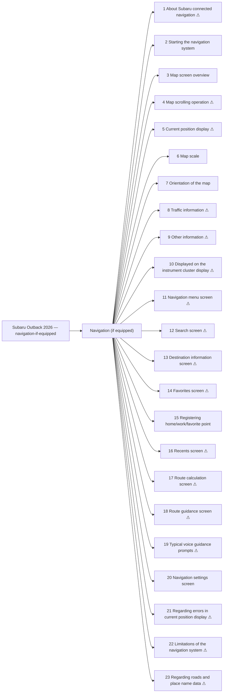

<!-- GENERATED:START index (generated; edits inside this block are overwritten by the next publish — write your own notes outside it) -->
# Subaru Outback 2026 — navigation-if-equipped — Presumed specification

> This is a machine-derived estimate, not an official requirements document. Numeric thresholds left blank could not be found in the manual and must be filled in by a tester with evidence.

| Field | Value |
|---|---|
| Maker / Model | Subaru / Outback 2026 |
| Scope | navigation-if-equipped |
| Markets | — |
| Profile | subaru_v1 |
| Manual ID | subaru/outback-2026/multimedia |

## Numeric thresholds
Filled: 0 / Unfilled: 0

```mermaid
pie showData
    "Filled" : 0
    "Unfilled" : 0
```

## Figures in the manual
17 figure area(s) detected.

## Functions



| No. | Function | Area | Requirements | Figures | Unfilled thresholds | Test-ready |
|---|---|---|---|---|---|---|
| 1 | About Subaru connected navigation | Navigation (if equipped) | 10 | 2 | 0 | - |
| 2 | Starting the navigation system | Navigation (if equipped) | 3 | 0 | 0 | o |
| 3 | Map screen overview | Navigation (if equipped) | 10 | 1 | 0 | o |
| 4 | Map scrolling operation | Navigation (if equipped) | 2 | 0 | 0 | - |
| 5 | Current position display | Navigation (if equipped) | 3 | 0 | 0 | - |
| 6 | Map scale | Navigation (if equipped) | 4 | 0 | 0 | o |
| 7 | Orientation of the map | Navigation (if equipped) | 8 | 3 | 0 | o |
| 8 | Traffic information | Navigation (if equipped) | 6 | 1 | 0 | - |
| 9 | Other information | Navigation (if equipped) | 8 | 2 | 0 | - |
| 10 | Displayed on the instrument cluster display | Navigation (if equipped) | 2 | 1 | 0 | - |
| 11 | Navigation menu screen | Navigation (if equipped) | 9 | 1 | 0 | - |
| 12 | Search screen | Navigation (if equipped) | 6 | 1 | 0 | - |
| 13 | Destination information screen | Navigation (if equipped) | 9 | 1 | 0 | - |
| 14 | Favorites screen | Navigation (if equipped) | 12 | 1 | 0 | - |
| 15 | Registering home/work/favorite point | Navigation (if equipped) | 5 | 0 | 0 | o |
| 16 | Recents screen | Navigation (if equipped) | 6 | 1 | 0 | - |
| 17 | Route calculation screen | Navigation (if equipped) | 11 | 1 | 0 | - |
| 18 | Route guidance screen | Navigation (if equipped) | 18 | 1 | 0 | - |
| 19 | Typical voice guidance prompts | Navigation (if equipped) | 6 | 0 | 0 | - |
| 20 | Navigation settings screen | Navigation (if equipped) | 1 | 0 | 0 | o |
| 21 | Regarding errors in current position display | Navigation (if equipped) | 1 | 0 | 0 | - |
| 22 | Limitations of the navigation system | Navigation (if equipped) | 38 | 0 | 0 | - |
| 23 | Regarding roads and place name data | Navigation (if equipped) | 1 | 0 | 0 | - |
<!-- GENERATED:END index -->


