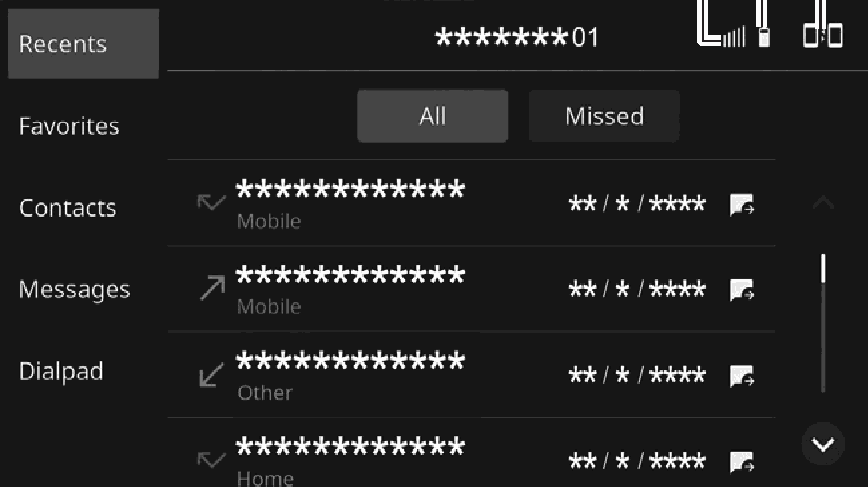

<!-- GENERATED:START function=e35fb8eec3d2 (generated; edits inside this block are overwritten by the next publish — write your own notes outside it) -->
# 1. Phone screen

<b>Function path:</b> Phone / Phone screen <b>Source:</b> printed page 74, 75 <b>Test-ready:</b> no — procedure missing or thresholds unfilled

Every "Presumed requirement" row below is machine-derived from the Owner's Manual text by rule-based extraction — not AI-written — and traceable to the printed page in its Source column.

## Figures (areas of the original PDF; the OM has no figure numbers or captions)

- Figure 1-1 source: p.74
- (Copied from OM) Touch “[icon]” to activate Android Auto. (→P.70)

## 1-2-1. Service overview

| # | Presumed requirement | Strength | Source |
|---|---|---|---|
| 1 | Phone screenThe phone screen can be accessed with the following methods:. | capability | p.74 / text |

## 1-2-2. Service requirements

| # | Presumed requirement | Strength | Source |
|---|---|---|---|
| 1 | Step -Touch “[icon]” of the main menu. (→P.19). | capability | p.74 / bullet |
| 2 | Step -Press the switch on the steering wheel. | capability | p.74 / bullet |
| 3 | Step -If a message is displayed, register/connect according to the content displayed. (→P.55, P.57). | capability | p.74 / bullet |
| 4 | Step -When Apple CarPlay/Android Auto is used, “[icon]” of the main menu will change to the corresponding icon. Touch “[icon]” to activate Apple CarPlay. (→P.67) Touch “[icon]” to activate Android Auto. (→P.70). | capability | p.74 / bullet |
| 5 | Phone screenDisplay the remaining of Bluetooth device battery charge. The amount displayed does not always correspond with the amount displayed on the Bluetooth device. | capability | p.74 / text |
| 6 | Phone screenDisplays the manage device settings screen. (→P.44). | capability | p.75 / text |

## 1-5. Exception operation

| # | Presumed requirement | Strength | Source |
|---|---|---|---|
| 1 | Phone screenDisplay the level of phone reception. If a cellular phone is not connected via Bluetooth, this icon will not be displayed. The level of reception does not always correspond with the level displayed on the cellular phone. The level of reception may not be displayed depending on the phone you have. | constraint | p.74 / text |
<!-- GENERATED:END function=e35fb8eec3d2 -->

