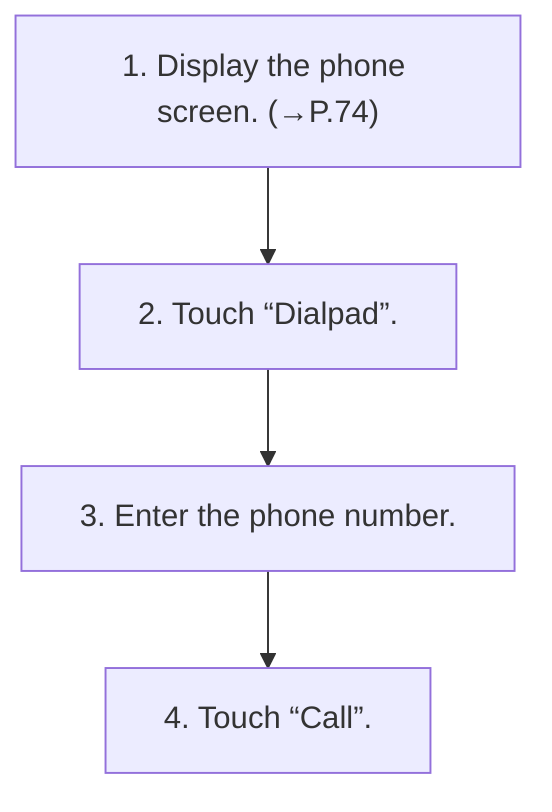

<!-- GENERATED:START function=b1554f940f00 (generated; edits inside this block are overwritten by the next publish — write your own notes outside it) -->
# 10. By dialpad

<b>Function path:</b> Phone / By dialpad <b>Source:</b> printed page 80 <b>Test-ready:</b> yes — no unfilled thresholds and a procedure is present

Every "Presumed requirement" row below is machine-derived from the Owner's Manual text by rule-based extraction — not AI-written — and traceable to the printed page in its Source column.

## Procedure

| Seq | Step | Operation (Copied from OM) | Source |
|---|---|---|---|
| 1 | 1 | Display the phone screen. (→P.74) | p.80 / step |
| 2 | 2 | Touch “Dialpad”. | p.80 / step |
| 3 | 3 | Enter the phone number. | p.80 / step |
| 4 | 4 | Touch “Call”. | p.80 / step |

## 10-2-2. Service requirements

| # | Presumed requirement | Strength | Source |
|---|---|---|---|
| 1 | Step -The outgoing call screen is displayed. | capability | p.80 / bullet |
| 2 | Step -Depending on the type of Bluetooth phone being connected, it may be necessary to perform additional steps on the phone. | capability | p.80 / bullet |
<!-- GENERATED:END function=b1554f940f00 -->

