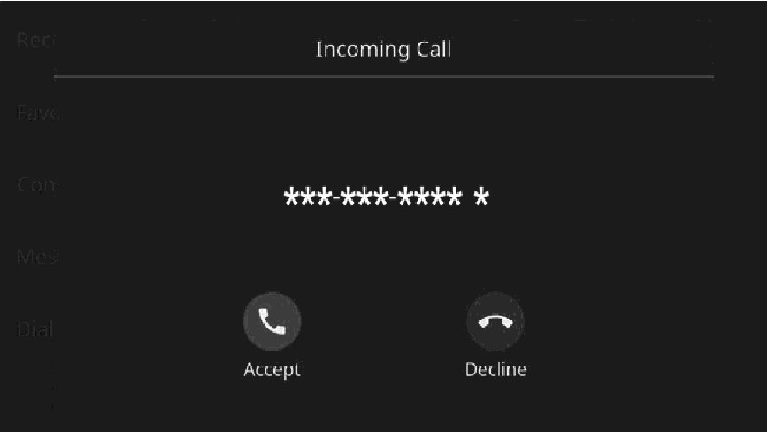
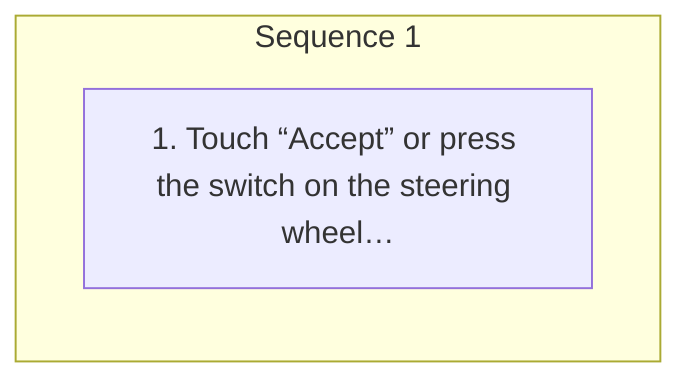

<!-- GENERATED:START function=b1c71e386534 (generated; edits inside this block are overwritten by the next publish — write your own notes outside it) -->
# 12. Incoming calls

<b>Function path:</b> Phone / Incoming calls <b>Source:</b> printed page 81 <b>Test-ready:</b> yes — no unfilled thresholds and a procedure is present

Every "Presumed requirement" row below is machine-derived from the Owner's Manual text by rule-based extraction — not AI-written — and traceable to the printed page in its Source column.

## Figures (areas of the original PDF; the OM has no figure numbers or captions)

- Figure 12-1 source: p.81
- (Copied from OM) “Decline” or press the switch on

## Procedure

| Seq | Step | Operation (Copied from OM) | Source |
|---|---|---|---|
| 1 | 1 | Touch “Accept” or press the switch on the steering wheel to talk on the phone. To refuse to receive the call: Touch “Decline” or press the switch on the steering wheel. To adjust the volume of a received call: Turn the VOLUME knob, or use the +/- switch on the steering wheel. | p.81 / step |

## 12-2-1. Service overview

| # | Presumed requirement | Strength | Source |
|---|---|---|---|
| 1 | Incoming callsWhen a call is received, the incoming call screen pops up with sound. | capability | p.81 / text |

## 12-2-2. Service requirements

| # | Presumed requirement | Strength | Source |
|---|---|---|---|
| 1 | Step -The ringtone volume can also be set from the sound settings screen.(→P.41). | capability | p.81 / bullet |

## 12-5. Exception operation

| # | Presumed requirement | Strength | Source |
|---|---|---|---|
| 1 | Step -During international phone calls, the other party’s name or number may not be displayed cor- 4 rectly depending on the type of cellular phone you have. | capability | p.81 / bullet |
<!-- GENERATED:END function=b1c71e386534 -->

