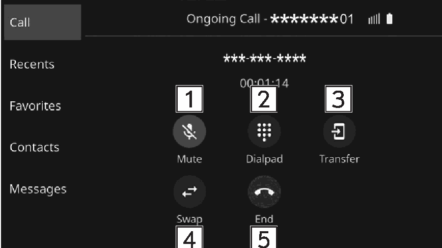

<!-- GENERATED:START function=26fd43965619 (generated; edits inside this block are overwritten by the next publish — write your own notes outside it) -->
# 13. Talking on the Bluetooth phone

<b>Function path:</b> Phone / Talking on the Bluetooth phone <b>Source:</b> printed page 81, 82 <b>Test-ready:</b> no — procedure missing or thresholds unfilled

Every "Presumed requirement" row below is machine-derived from the Owner's Manual text by rule-based extraction — not AI-written — and traceable to the printed page in its Source column.

## Figures (areas of the original PDF; the OM has no figure numbers or captions)

- Figure 13-1 source: p.81
- (Copied from OM) Select to mute your voice to the other party.

## 13-2-1. Service overview

| # | Presumed requirement | Strength | Source |
|---|---|---|---|
| 1 | Talking on the Bluetooth phoneWhile talking on the phone, this screen is displayed. The operations outlined below can be performed on this screen. | capability | p.81 / text |
| 2 | Talking on the Bluetooth phoneSelect to mute your voice to the other party. | capability | p.81 / text |
| 3 | Talking on the Bluetooth phoneSelect to enter the desired numbers/output tones. | capability | p.81 / text |
| 4 | Talking on the Bluetooth phoneSelect to transfer the call. Touch “Transfer” to change from a hands-free call to a cellular phone call. Touch “Transfer Back” to change from cellular phone call to hands-free call. | capability | p.82 / text |
| 5 | Talking on the Bluetooth phoneWhen a call is put on hold by pressing the switch on the steering wheel: Select to resume the on-hold call. | capability | p.82 / text |
| 6 | Talking on the Bluetooth phoneSelect to hang up the phone. | capability | p.82 / text |

## 13-2-2. Service requirements

| # | Presumed requirement | Strength | Source |
|---|---|---|---|
| 1 | Step -Pressing switch on the steering wheel during a call will put the call on hold. Pressing switch on the steering wheel again will resume the on-hold call. | capability | p.82 / bullet |
| 2 | Step -Changing between cellular phone call and hands-free call can be performed by operating the cellular phone directly. Transferring methods and operations will be different depending on the type of cellular phone you have. For the operation of the cellular phone, see the manual that comes with it. | capability | p.82 / bullet |
| 3 | Step -Turn the VOLUME knob, or use the +/- switch on the steering wheel to adjust the volume of the other party’s voice. | capability | p.82 / bullet |
<!-- GENERATED:END function=26fd43965619 -->

