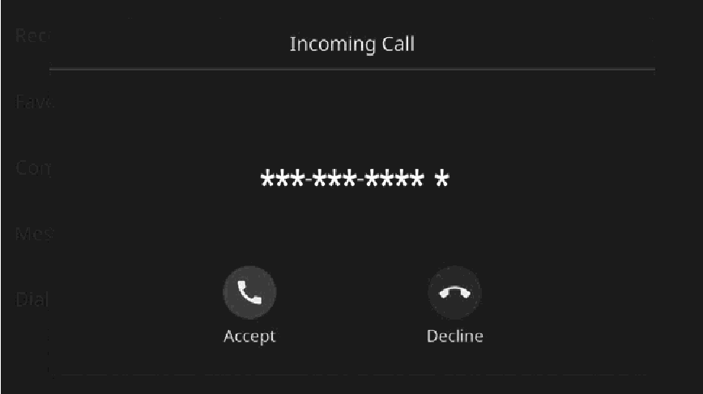
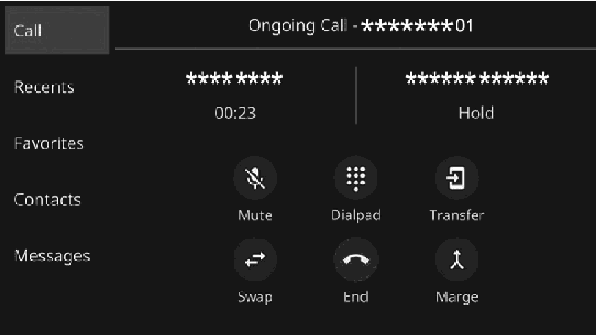
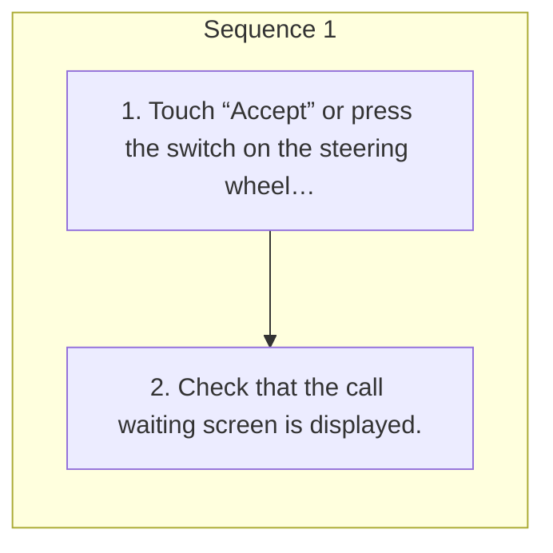

<!-- GENERATED:START function=2dd38fc77be2 (generated; edits inside this block are overwritten by the next publish — write your own notes outside it) -->
# 14. Call waiting

<b>Function path:</b> Phone / Call waiting <b>Source:</b> printed page 82, 83 <b>Test-ready:</b> yes — no unfilled thresholds and a procedure is present

Every "Presumed requirement" row below is machine-derived from the Owner's Manual text by rule-based extraction — not AI-written — and traceable to the printed page in its Source column.

## Figures (areas of the original PDF; the OM has no figure numbers or captions)

- Figure 14-1 source: p.82
- (Copied from OM) ● The first call is put on hold.

- Figure 14-2 source: p.83
- (Copied from OM) who is on hold will be switched.

## Procedure

| Seq | Step | Operation (Copied from OM) | Source |
|---|---|---|---|
| 1 | 1 | Touch “Accept” or press the switch on the steering wheel to start talking with the other party. | p.82 / step |
| 1 | 2 | Check that the call waiting screen is displayed. | p.83 / step |

## 14-2-1. Service overview

| # | Presumed requirement | Strength | Source |
|---|---|---|---|
| 1 | Call waitingWhen a call is interrupted by a third party while talking, the incoming call screen pops up with sound. | capability | p.82 / text |

## 14-2-2. Service requirements

| # | Presumed requirement | Strength | Source |
|---|---|---|---|
| 1 | Step -The first call is put on hold. To refuse to receive the call: Touch “Decline” or press the switch on the steering wheel. To end both the first call and second call, press and hold switch on the steering wheel. | capability | p.82 / bullet |
| 2 | Step -“Swap”: Select to change parties. Each time “Swap” or name area is selected, or press the switch on the steering wheel, the party who is on hold will be switched. | capability | p.83 / bullet |
| 3 | Step -Touch “Merge” or press and hold the switch on the steering wheel to change to a conference call.*. | capability | p.83 / bullet |
| 4 | Step -Touch “End” or press the switch on the steering wheel to end the call and return to the conversation with the party on hold when having a two-way conversation, and to end the call with both parties when having a three-way conversation. | constraint | p.83 / bullet |

## 14-5. Exception operation

| # | Presumed requirement | Strength | Source |
|---|---|---|---|
| 1 | Step -To end all of the calls connected, press and hold switch on the steering wheel. *: Depending on the company of the Bluetooth phone that is connected to the system, the conference call function may not be available. 4. | capability | p.83 / bullet |
<!-- GENERATED:END function=2dd38fc77be2 -->

