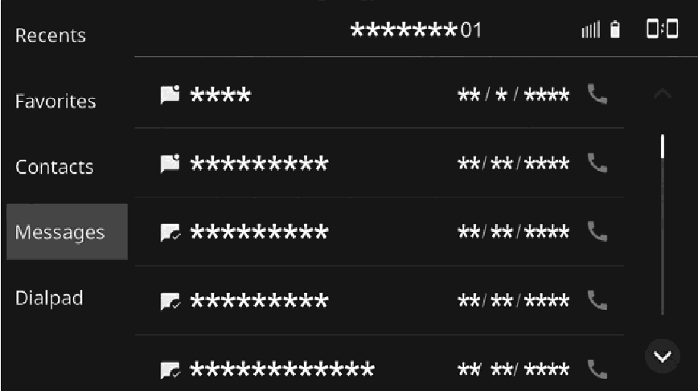
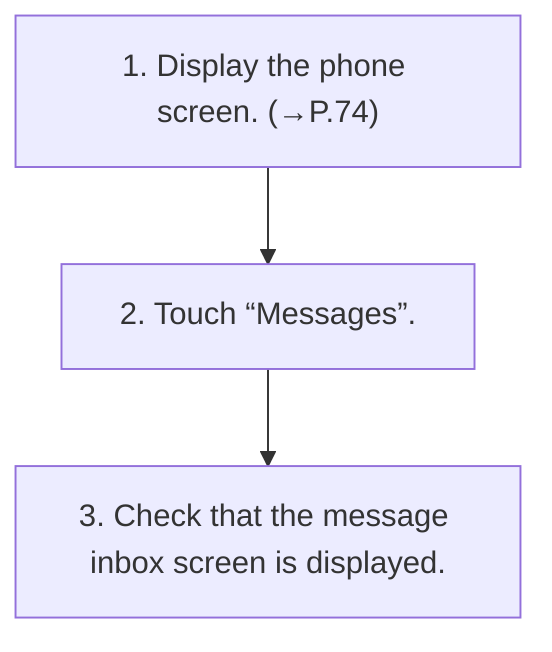

<!-- GENERATED:START function=4e595c9321c1 (generated; edits inside this block are overwritten by the next publish — write your own notes outside it) -->
# 15. Bluetooth phone message function

<b>Function path:</b> Phone / Bluetooth phone message function <b>Source:</b> printed page 83, 84 <b>Test-ready:</b> yes — no unfilled thresholds and a procedure is present

Every "Presumed requirement" row below is machine-derived from the Owner's Manual text by rule-based extraction — not AI-written — and traceable to the printed page in its Source column.

## Figures (areas of the original PDF; the OM has no figure numbers or captions)

- Figure 15-1 source: p.84
- (Copied from OM) reply): →P.86

## Procedure

| Seq | Step | Operation (Copied from OM) | Source |
|---|---|---|---|
| 1 | 1 | Display the phone screen. (→P.74) | p.83 / step |
| 2 | 2 | Touch “Messages”. | p.83 / step |
| 3 | 3 | Check that the message inbox screen is displayed. | p.84 / step |

## 15-2-1. Service overview

| # | Presumed requirement | Strength | Source |
|---|---|---|---|
| 1 | Bluetooth phone message functionReceived messages can be forwarded from the connected Bluetooth phone, enabling checking and replying using the system. | capability | p.83 / text |
| 2 | Bluetooth phone message functionDepending on the type of Bluetooth phone connected, received messages may not be transferred to the message inbox. | capability | p.83 / text |
| 3 | Bluetooth phone message functionIf the phone does not support the message function, this function cannot be used. | constraint | p.83 / text |
| 4 | Bluetooth phone message functionDepending on the Bluetooth phone type, the screen display may differ, and it may not be possible to use certain functions. | capability | p.83 / text |
| 5 | Bluetooth phone message functionTo use this function, it is necessary to enable “Sync” for messages on the phone settings screen. (→P.45). | capability | p.83 / text |

## 15-2-2. Service requirements

| # | Presumed requirement | Strength | Source |
|---|---|---|---|
| 1 | Step -Depending on the model of your Bluetooth phone, the setting of the connected phone may need to be changed. (ex: For iOS or other models, the notification setting may need to be activated.) For details, check the instructions for the connected Bluetooth phone. | capability | p.83 / bullet |
| 2 | Step -“[icon]”: Unread message icon. | capability | p.84 / bullet |
| 3 | Step -Receiving a message: →P.84. | capability | p.84 / bullet |
| 4 | Step -Checking messages: →P.85. | capability | p.84 / bullet |
| 5 | Step -Replying to a message (quick reply): →P.86. | capability | p.84 / bullet |
| 6 | Step -Sending a new short message: → P.86. | capability | p.84 / bullet |
| 7 | Step -Calling the message sender: → P.86. | capability | p.84 / bullet |
<!-- GENERATED:END function=4e595c9321c1 -->

