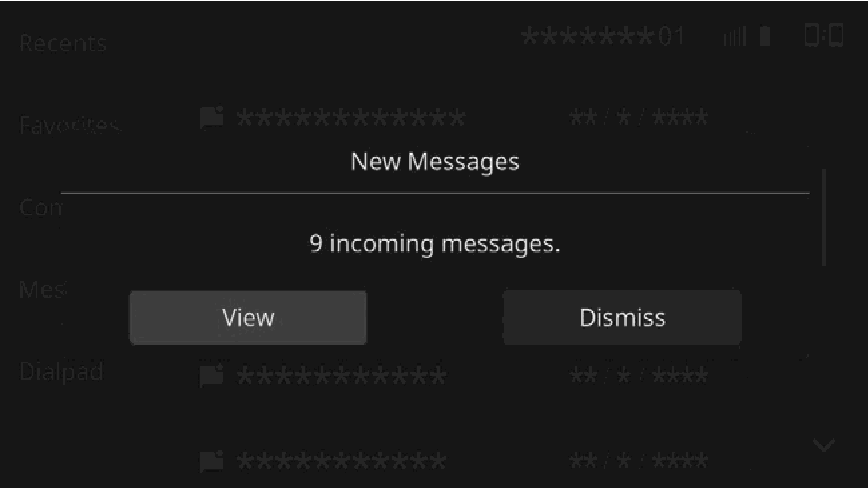
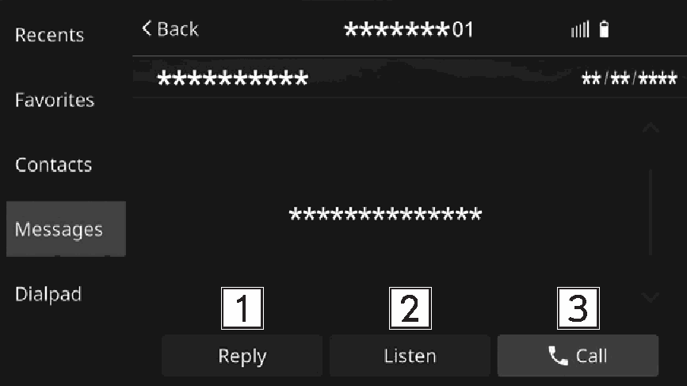
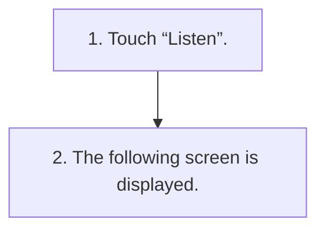

<!-- GENERATED:START function=347befe594c3 (generated; edits inside this block are overwritten by the next publish — write your own notes outside it) -->
# 16. Receiving a message

<b>Function path:</b> Phone / Receiving a message <b>Source:</b> printed page 84, 85 <b>Test-ready:</b> yes — no unfilled thresholds and a procedure is present

Every "Presumed requirement" row below is machine-derived from the Owner's Manual text by rule-based extraction — not AI-written — and traceable to the printed page in its Source column.

## Figures (areas of the original PDF; the OM has no figure numbers or captions)

- Figure 16-1 source: p.84
- (Copied from OM) ● “View”: Select to display the message inbox screen.

- Figure 16-2 source: p.85
- (Copied from OM) 2. The following screen is displayed.

## Procedure

| Seq | Step | Operation (Copied from OM) | Source |
|---|---|---|---|
| 1 | 1 | Touch “Listen”. | p.84 / step |
| 2 | 2 | The following screen is displayed. | p.85 / step |

## 16-2-1. Service overview

| # | Presumed requirement | Strength | Source |
|---|---|---|---|
| 1 | Receiving a messageWhen an SMS/MMS is received, the incoming message screen pops up with sound and is ready to be operated on the screen. | capability | p.84 / text |

## 16-2-2. Service requirements

| # | Presumed requirement | Strength | Source |
|---|---|---|---|
| 1 | Step -Touch “Dismiss” to not open the message. | capability | p.84 / bullet |
| 2 | Receiving a messageIf there are any unread messages The following screen is displayed. | capability | p.84 / text |
| 3 | Step -“View”: Select to display the message inbox screen. | capability | p.84 / bullet |
| 4 | Step -“Dismiss”: Select to not open the message. | capability | p.84 / bullet |
| 5 | Receiving a messageSelect to reply the message. (→P.86) *. | capability | p.85 / text |
| 6 | Receiving a messageSelect to have messages read out. | capability | p.85 / text |
| 7 | Step -Touch “Stop” to stop the message read out. | capability | p.85 / bullet |
| 8 | Receiving a messageSelect to call the message sender. | capability | p.85 / text |
| 9 | Receiving a message4 *: Depending on the Bluetooth phone that is connected to the audio system, this function is not available. | capability | p.85 / text |
| 10 | Step -To notify SMS/MMS reception by message and sound, it is necessary to enable “Incoming Message Notifications” for messages on the phone settings screen. (→P.45). | capability | p.85 / bullet |

## 16-5. Exception operation

| # | Presumed requirement | Strength | Source |
|---|---|---|---|
| 1 | Step -Depending on the cellular phone used for receiving messages, or its registration status with the system, some information may not be displayed. | capability | p.85 / bullet |
<!-- GENERATED:END function=347befe594c3 -->
