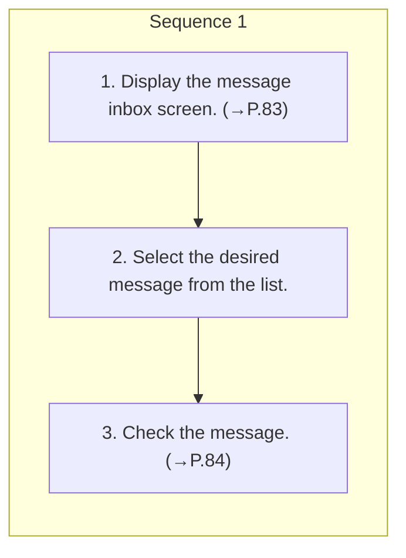

<!-- GENERATED:START function=7a58369e0ec2 (generated; edits inside this block are overwritten by the next publish — write your own notes outside it) -->
# 17. Checking messages

<b>Function path:</b> Phone / Checking messages <b>Source:</b> printed page 85 <b>Test-ready:</b> yes — no unfilled thresholds and a procedure is present

Every "Presumed requirement" row below is machine-derived from the Owner's Manual text by rule-based extraction — not AI-written — and traceable to the printed page in its Source column.

## Procedure

| Seq | Step | Operation (Copied from OM) | Source |
|---|---|---|---|
| 1 | 1 | Display the message inbox screen. (→P.83) | p.85 / step |
| 1 | 2 | Select the desired message from the list. | p.85 / step |
| 1 | 3 | Check the message. (→P.84) | p.85 / step |

## 17-2-2. Service requirements

| # | Presumed requirement | Strength | Source |
|---|---|---|---|
| 1 | Step -Depending on the type of Bluetooth phone being connected, it may be necessary to perform additional steps on the phone. | capability | p.85 / bullet |
| 2 | Step -Only received messages on the connected Bluetooth phone can be displayed. | capability | p.85 / bullet |
| 3 | Step -The text of the message is not displayed while driving. | capability | p.85 / bullet |
| 4 | Step -Turn the VOLUME knob, or use the +/- switch on the steering wheel to adjust the message readout volume. | capability | p.85 / bullet |
<!-- GENERATED:END function=7a58369e0ec2 -->

