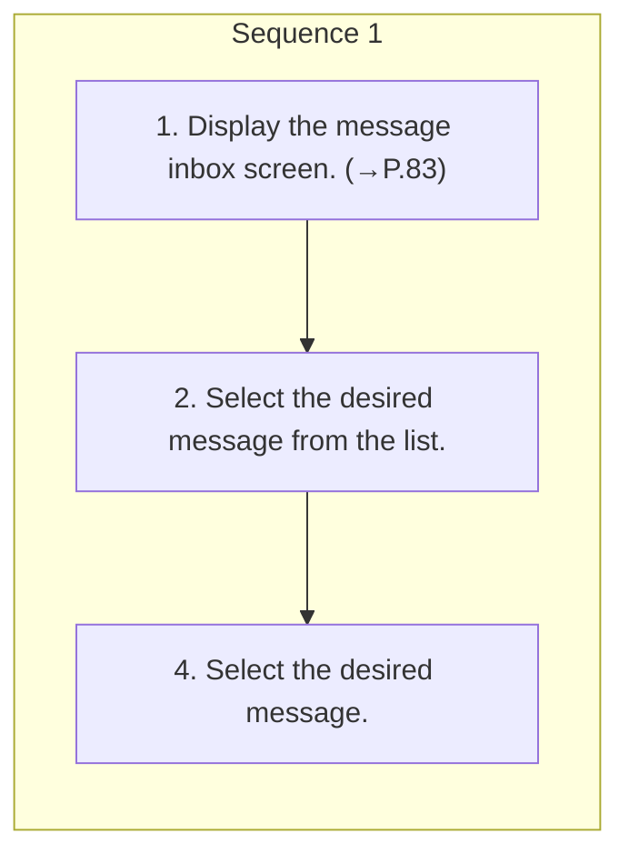

<!-- GENERATED:START function=55e6ab7b677a (generated; edits inside this block are overwritten by the next publish — write your own notes outside it) -->
# 18. Replying to a message (quick reply)

<b>Function path:</b> Phone / Replying to a message (quick reply) <b>Source:</b> printed page 86 <b>Test-ready:</b> yes — no unfilled thresholds and a procedure is present

Every "Presumed requirement" row below is machine-derived from the Owner's Manual text by rule-based extraction — not AI-written — and traceable to the printed page in its Source column.

## Procedure

| Seq | Step | Operation (Copied from OM) | Source |
|---|---|---|---|
| 1 | 1 | Display the message inbox screen. (→P.83) | p.86 / step |
| 1 | 2 | Select the desired message from the list. | p.86 / step |
| 1 | 4 | Select the desired message. | p.86 / step |

## 18-2-1. Service overview

| # | Presumed requirement | Strength | Source |
|---|---|---|---|
| 1 | Replying to a message (quick reply)3. → “Reply”. | capability | p.86 / text |

## 18-2-2. Service requirements

| # | Presumed requirement | Strength | Source |
|---|---|---|---|
| 1 | Step -“[icon]”: Select to change the message. | capability | p.86 / bullet |
| 2 | Replying to a message (quick reply)5. → “Send”. | capability | p.86 / text |
| 3 | Step -“Cancel”: Select to cancel sending the message. | capability | p.86 / bullet |
| 4 | Step -10 messages have already been stored. | capability | p.86 / bullet |
| 5 | Step -Messages can also be edited on the phone settings screen. (→P.45). | capability | p.86 / bullet |

## 18-5. Exception operation

| # | Presumed requirement | Strength | Source |
|---|---|---|---|
| 1 | Step -Depending on the connected Bluetooth phone device, the replying function to a message may not be available. | capability | p.86 / bullet |
<!-- GENERATED:END function=55e6ab7b677a -->

