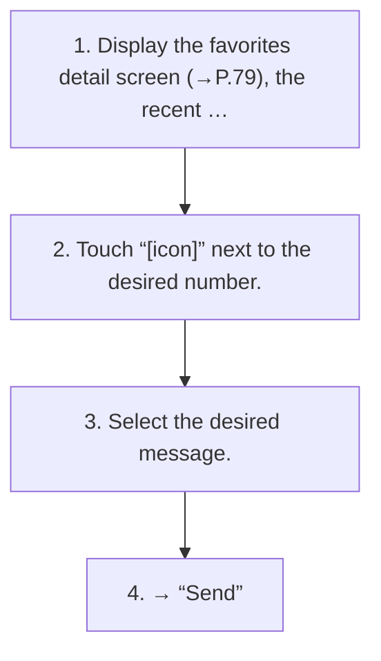

<!-- GENERATED:START function=b8bfdc423001 (generated; edits inside this block are overwritten by the next publish — write your own notes outside it) -->
# 19. Sending a new short message

<b>Function path:</b> Phone / Sending a new short message <b>Source:</b> printed page 86 <b>Test-ready:</b> yes — no unfilled thresholds and a procedure is present

Every "Presumed requirement" row below is machine-derived from the Owner's Manual text by rule-based extraction — not AI-written — and traceable to the printed page in its Source column.

## Procedure

| Seq | Step | Operation (Copied from OM) | Source |
|---|---|---|---|
| 1 | 1 | Display the favorites detail screen (→P.79), the recent calls list screen (→P.78) or the contact detail screen (→P.80). | p.86 / step |
| 2 | 2 | Touch “[icon]” next to the desired number. | p.86 / step |
| 3 | 3 | Select the desired message. | p.86 / step |
| 4 | 4 | → “Send” | p.86 / step |

## 19-2-2. Service requirements

| # | Presumed requirement | Strength | Source |
|---|---|---|---|
| 1 | Step -“[icon]”: Select to change the message. | capability | p.86 / bullet |
| 2 | Step -“Cancel”: Select to cancel sending the message. | capability | p.86 / bullet |
<!-- GENERATED:END function=b8bfdc423001 -->
