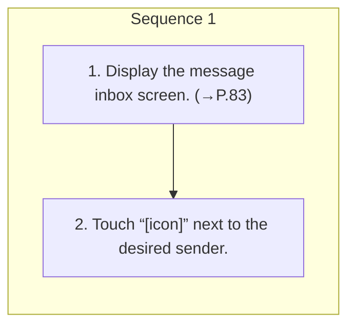

<!-- GENERATED:START function=396f0680313c (generated; edits inside this block are overwritten by the next publish — write your own notes outside it) -->
# 20. Calling the message sender

<b>Function path:</b> Phone / Calling the message sender <b>Source:</b> printed page 86 <b>Test-ready:</b> yes — no unfilled thresholds and a procedure is present

Every "Presumed requirement" row below is machine-derived from the Owner's Manual text by rule-based extraction — not AI-written — and traceable to the printed page in its Source column.

## Procedure

| Seq | Step | Operation (Copied from OM) | Source |
|---|---|---|---|
| 1 | 1 | Display the message inbox screen. (→P.83) | p.86 / step |
| 1 | 2 | Touch “[icon]” next to the desired sender. | p.86 / step |

## 20-2-1. Service overview

| # | Presumed requirement | Strength | Source |
|---|---|---|---|
| 1 | Calling the message senderCalls can be made to an SMS/MMS message sender’s phone number. | capability | p.86 / text |

## 20-2-2. Service requirements

| # | Presumed requirement | Strength | Source |
|---|---|---|---|
| 1 | Step -The outgoing call screen is displayed. | capability | p.86 / bullet |
<!-- GENERATED:END function=396f0680313c -->

