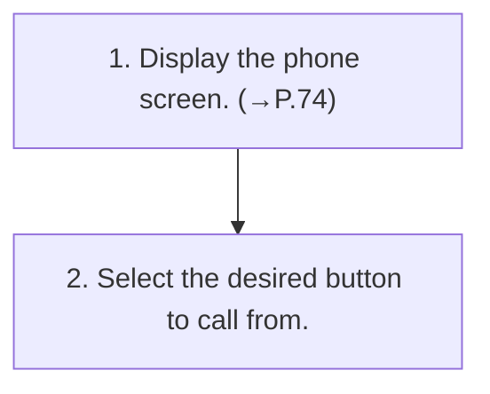

<!-- GENERATED:START function=5168905a394b (generated; edits inside this block are overwritten by the next publish — write your own notes outside it) -->
# 7. Calling on the Bluetooth phone

<b>Function path:</b> Phone / Calling on the Bluetooth phone <b>Source:</b> printed page 78 <b>Test-ready:</b> yes — no unfilled thresholds and a procedure is present

Every "Presumed requirement" row below is machine-derived from the Owner's Manual text by rule-based extraction — not AI-written — and traceable to the printed page in its Source column.

## Procedure

| Seq | Step | Operation (Copied from OM) | Source |
|---|---|---|---|
| 1 | 1 | Display the phone screen. (→P.74) | p.78 / step |
| 2 | 2 | Select the desired button to call from. | p.78 / step |

## 7-2-1. Service overview

| # | Presumed requirement | Strength | Source |
|---|---|---|---|
| 1 | Calling on the Bluetooth phoneAfter a Bluetooth phone has been registered, a call can be made using the hands-free system. There are several methods by which a call can be made, as described below. | capability | p.78 / text |

## 7-2-2. Service requirements

| # | Presumed requirement | Strength | Source |
|---|---|---|---|
| 1 | Step -By recent calls list: →P.78. | capability | p.78 / bullet |
| 2 | Step -By favorites list: →P.79. | capability | p.78 / bullet |
| 3 | Step -By dialpad*1: →P.80. | capability | p.78 / bullet |
| 4 | Step -By contacts list: →P.80. | capability | p.78 / bullet |
| 5 | Step -By SMS/MMS: →P.86. | capability | p.78 / bullet |
| 6 | Step -By POI call*2: →P.127. | capability | p.78 / bullet |

## 7-5. Exception operation

| # | Presumed requirement | Strength | Source |
|---|---|---|---|
| 1 | Step -By voice assistance system: →P.31 *1: The operation cannot be performed while driving. *2: If equipped. | constraint | p.78 / bullet |
<!-- GENERATED:END function=5168905a394b -->
