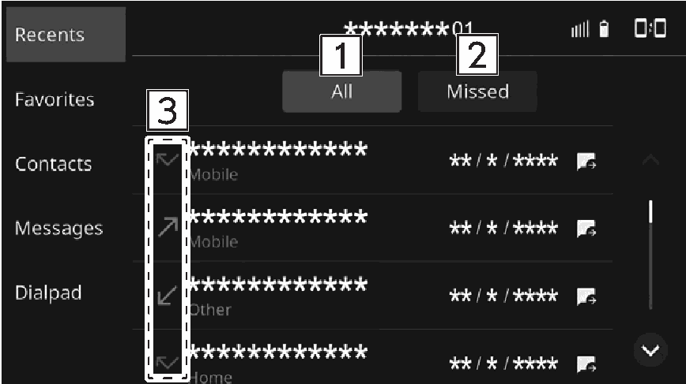
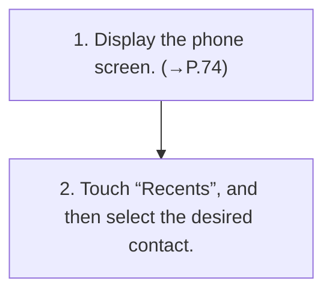

<!-- GENERATED:START function=8f58aee8fb6a (generated; edits inside this block are overwritten by the next publish — write your own notes outside it) -->
# 8. By recent calls list

<b>Function path:</b> Phone / By recent calls list <b>Source:</b> printed page 78, 79 <b>Test-ready:</b> yes — no unfilled thresholds and a procedure is present

Every "Presumed requirement" row below is machine-derived from the Owner's Manual text by rule-based extraction — not AI-written — and traceable to the printed page in its Source column.

## Figures (areas of the original PDF; the OM has no figure numbers or captions)

- Figure 8-1 source: p.79
- (Copied from OM) Select to display all latest call history items.

## Procedure

| Seq | Step | Operation (Copied from OM) | Source |
|---|---|---|---|
| 1 | 1 | Display the phone screen. (→P.74) | p.78 / step |
| 2 | 2 | Touch “Recents”, and then select the desired contact. | p.78 / step |

## 8-2-2. Service requirements

| # | Presumed requirement | Strength | Source |
|---|---|---|---|
| 1 | Step -The outgoing call screen is displayed. | capability | p.78 / bullet |
| 2 | By recent calls listSelect to display all latest call history items. | capability | p.79 / text |
| 3 | By recent calls listSelect to display missed calls. | capability | p.79 / text |
| 4 | By recent calls listDisplays the call type icons. “ ”: Missed call “ ”: Incoming call “ ”: Outgoing call 4. | capability | p.79 / text |
| 5 | Step -Pressing switch on the steering wheel will make a call to the phone number displayed at the top of the list. | capability | p.79 / bullet |
| 6 | Step -When a phone number registered in the contact list is received, the name is displayed. | capability | p.79 / bullet |

## 8-5. Exception operation

| # | Presumed requirement | Strength | Source |
|---|---|---|---|
| 1 | Step -International phone calls may not be made depending on the type of cellular phone you have. | capability | p.79 / bullet |
<!-- GENERATED:END function=8f58aee8fb6a -->

