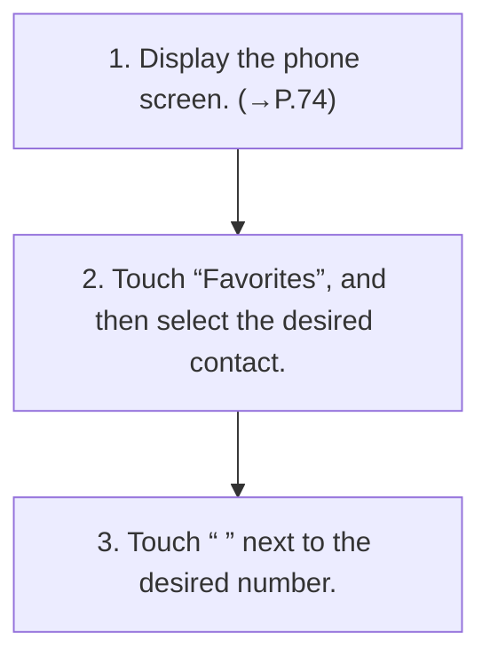

<!-- GENERATED:START function=734516c6a60c (generated; edits inside this block are overwritten by the next publish — write your own notes outside it) -->
# 9. By favorites list

<b>Function path:</b> Phone / By favorites list <b>Source:</b> printed page 79, 80 <b>Test-ready:</b> yes — no unfilled thresholds and a procedure is present

Every "Presumed requirement" row below is machine-derived from the Owner's Manual text by rule-based extraction — not AI-written — and traceable to the printed page in its Source column.

## Procedure

| Seq | Step | Operation (Copied from OM) | Source |
|---|---|---|---|
| 1 | 1 | Display the phone screen. (→P.74) | p.79 / step |
| 2 | 2 | Touch “Favorites”, and then select the desired contact. | p.79 / step |
| 3 | 3 | Touch “ ” next to the desired number. | p.79 / step |

## 9-2-1. Service overview

| # | Presumed requirement | Strength | Source |
|---|---|---|---|
| 1 | By favorites listCalls can be made to contacts registered as favorites of the connected Bluetooth phone. | capability | p.79 / text |

## 9-2-2. Service requirements

| # | Presumed requirement | Strength | Source |
|---|---|---|---|
| 1 | Step -When “ ” is displayed next to the desired contact, selecting it will display the outgoing call screen. | capability | p.79 / bullet |
| 2 | Step -The outgoing call screen is displayed. | capability | p.79 / bullet |
| 3 | Step -Up to 50 favorites can be downloaded and displayed on the favorites screen. (Up to 5 phone numbers per favorite will be downloaded.). | capability | p.80 / bullet |
| 4 | Step -When “Sync” is set to on, favorites is downloaded automatically. (→P.45). | capability | p.80 / bullet |
| 5 | Step -The order of the phonebook list can be sorted by first name or last name. (→P.45). | capability | p.80 / bullet |
<!-- GENERATED:END function=734516c6a60c -->

