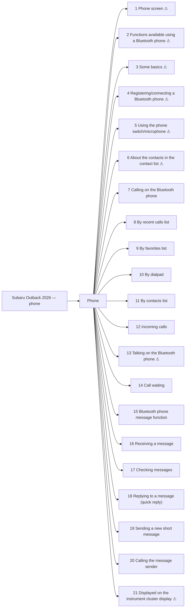

<!-- GENERATED:START index (generated; edits inside this block are overwritten by the next publish — write your own notes outside it) -->
# Subaru Outback 2026 — phone — Presumed specification

> This is a machine-derived estimate, not an official requirements document. Numeric thresholds left blank could not be found in the manual and must be filled in by a tester with evidence.

| Field | Value |
|---|---|
| Maker / Model | Subaru / Outback 2026 |
| Scope | phone |
| Markets | US, CA |
| Profile | subaru_v1 |
| Manual ID | subaru/outback-2026/ivi |

## Numeric thresholds
Filled: 0 / Unfilled: 0

```mermaid
pie showData
    "Filled" : 0
    "Unfilled" : 0
```

## Figures in the manual
9 figure area(s) detected.

## Functions



| No. | Function | Area | Requirements | Figures | Unfilled thresholds | Test-ready |
|---|---|---|---|---|---|---|
| 1 | Phone screen | Phone | 8 | 1 | 0 | - |
| 2 | Functions available using a Bluetooth phone | Phone | 5 | 0 | 0 | - |
| 3 | Some basics | Phone | 26 | 0 | 0 | - |
| 4 | Registering/connecting a Bluetooth phone | Phone | 3 | 0 | 0 | - |
| 5 | Using the phone switch/microphone | Phone | 7 | 0 | 0 | - |
| 6 | About the contacts in the contact list | Phone | 2 | 0 | 0 | - |
| 7 | Calling on the Bluetooth phone | Phone | 8 | 0 | 0 | o |
| 8 | By recent calls list | Phone | 7 | 1 | 0 | o |
| 9 | By favorites list | Phone | 6 | 0 | 0 | o |
| 10 | By dialpad | Phone | 2 | 0 | 0 | o |
| 11 | By contacts list | Phone | 6 | 0 | 0 | o |
| 12 | Incoming calls | Phone | 3 | 1 | 0 | o |
| 13 | Talking on the Bluetooth phone | Phone | 9 | 1 | 0 | - |
| 14 | Call waiting | Phone | 6 | 2 | 0 | o |
| 15 | Bluetooth phone message function | Phone | 12 | 1 | 0 | o |
| 16 | Receiving a message | Phone | 12 | 2 | 0 | o |
| 17 | Checking messages | Phone | 4 | 0 | 0 | o |
| 18 | Replying to a message (quick reply) | Phone | 5 | 0 | 0 | o |
| 19 | Sending a new short message | Phone | 2 | 0 | 0 | o |
| 20 | Calling the message sender | Phone | 2 | 0 | 0 | o |
| 21 | Displayed on the instrument cluster display | Phone | 1 | 0 | 0 | - |
<!-- GENERATED:END index -->


