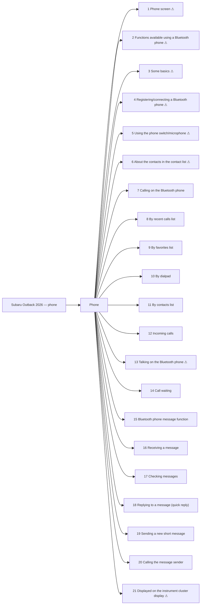

<!-- GENERATED:START index (generated; edits inside this block are overwritten by the next publish — write your own notes outside it) -->
# Subaru Outback 2026 — phone — Presumed specification

> This is a machine-derived estimate, not an official requirements document. Numeric thresholds left blank could not be found in the manual and must be filled in by a tester with evidence.

| Field | Value |
|---|---|
| Maker / Model | Subaru / Outback 2026 |
| Scope | phone |
| Markets | US, CA |
| Profile | subaru_v1 |
| Manual ID | subaru/outback-2026/ivi |

## Numeric thresholds

- Thresholds detected: **0**
- Filled: **0** / unfilled: **0**
- Test-ready functions: **13 / 21**

The manual states almost no numbers, so a tester fills the thresholds in. A function that still has an unfilled threshold cannot become a test specification (`is_test_ready=false`). Fill them in `overlay/thresholds.yaml` or on the screen.

```mermaid
pie showData
    "Filled" : 0
    "Unfilled" : 0
```

## Figures in the manual

- Figures: **9** / images rendered: **9**

Each image is a rendering of the corresponding area of the original PDF. **Images are not kept in the repository** (they are copies of another company's manual); `publish` creates them under `../figures/` on the machine that runs it.

## Glossary (registered by a reviewer)

How wording in the manual maps to the in-house term. **The original text is not rewritten** — the mapping is only annotated here. Register terms on the Glossary screen. Evidence (why the mapping holds) is required.

| In-house term | Category | Wording in the manual | Hits | Evidence |
|---|---|---|---:|---|
| AA | abbreviation | `Android Auto` | 3 | Counted by string match over workspace/subaru/**/published/*.md (2026-09-01): outback-2026 31 / outback-2025 24 / ascent-2026 1. Always printed in full ("Android Auto") — no abbreviated form appears in the manual text; "AA" is an in-house-only abbreviation. |

## Functions



| No. | Function | Area | Requirements | Figures | Unfilled thresholds | Test-ready |
|---|---|---|---|---|---|---|
| 1 | [Phone screen](/specifications/subaru/outback-2026/ivi/file/1-phone-screen.md?chapter=phone) | Phone | 8 | 1 | 0 | - |
| 2 | [Functions available using a Bluetooth phone](/specifications/subaru/outback-2026/ivi/file/2-functions-available-using-a-bluetooth-phone.md?chapter=phone) | Phone | 5 | 0 | 0 | - |
| 3 | [Some basics](/specifications/subaru/outback-2026/ivi/file/3-some-basics.md?chapter=phone) | Phone | 26 | 0 | 0 | - |
| 4 | [Registering/connecting a Bluetooth phone](/specifications/subaru/outback-2026/ivi/file/4-registering-connecting-a-bluetooth-phone.md?chapter=phone) | Phone | 3 | 0 | 0 | - |
| 5 | [Using the phone switch/microphone](/specifications/subaru/outback-2026/ivi/file/5-using-the-phone-switch-microphone.md?chapter=phone) | Phone | 7 | 0 | 0 | - |
| 6 | [About the contacts in the contact list](/specifications/subaru/outback-2026/ivi/file/6-about-the-contacts-in-the-contact-list.md?chapter=phone) | Phone | 2 | 0 | 0 | - |
| 7 | [Calling on the Bluetooth phone](/specifications/subaru/outback-2026/ivi/file/7-calling-on-the-bluetooth-phone.md?chapter=phone) | Phone | 8 | 0 | 0 | o |
| 8 | [By recent calls list](/specifications/subaru/outback-2026/ivi/file/8-by-recent-calls-list.md?chapter=phone) | Phone | 7 | 1 | 0 | o |
| 9 | [By favorites list](/specifications/subaru/outback-2026/ivi/file/9-by-favorites-list.md?chapter=phone) | Phone | 6 | 0 | 0 | o |
| 10 | [By dialpad](/specifications/subaru/outback-2026/ivi/file/10-by-dialpad.md?chapter=phone) | Phone | 2 | 0 | 0 | o |
| 11 | [By contacts list](/specifications/subaru/outback-2026/ivi/file/11-by-contacts-list.md?chapter=phone) | Phone | 6 | 0 | 0 | o |
| 12 | [Incoming calls](/specifications/subaru/outback-2026/ivi/file/12-incoming-calls.md?chapter=phone) | Phone | 3 | 1 | 0 | o |
| 13 | [Talking on the Bluetooth phone](/specifications/subaru/outback-2026/ivi/file/13-talking-on-the-bluetooth-phone.md?chapter=phone) | Phone | 9 | 1 | 0 | - |
| 14 | [Call waiting](/specifications/subaru/outback-2026/ivi/file/14-call-waiting.md?chapter=phone) | Phone | 6 | 2 | 0 | o |
| 15 | [Bluetooth phone message function](/specifications/subaru/outback-2026/ivi/file/15-bluetooth-phone-message-function.md?chapter=phone) | Phone | 12 | 1 | 0 | o |
| 16 | [Receiving a message](/specifications/subaru/outback-2026/ivi/file/16-receiving-a-message.md?chapter=phone) | Phone | 12 | 2 | 0 | o |
| 17 | [Checking messages](/specifications/subaru/outback-2026/ivi/file/17-checking-messages.md?chapter=phone) | Phone | 4 | 0 | 0 | o |
| 18 | [Replying to a message (quick reply)](/specifications/subaru/outback-2026/ivi/file/18-replying-to-a-message-quick-reply.md?chapter=phone) | Phone | 5 | 0 | 0 | o |
| 19 | [Sending a new short message](/specifications/subaru/outback-2026/ivi/file/19-sending-a-new-short-message.md?chapter=phone) | Phone | 2 | 0 | 0 | o |
| 20 | [Calling the message sender](/specifications/subaru/outback-2026/ivi/file/20-calling-the-message-sender.md?chapter=phone) | Phone | 2 | 0 | 0 | o |
| 21 | [Displayed on the instrument cluster display](/specifications/subaru/outback-2026/ivi/file/21-displayed-on-the-instrument-cluster-display.md?chapter=phone) | Phone | 1 | 0 | 0 | - |
<!-- GENERATED:END index -->


