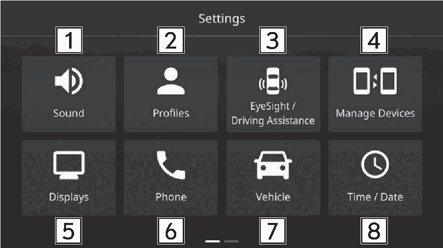
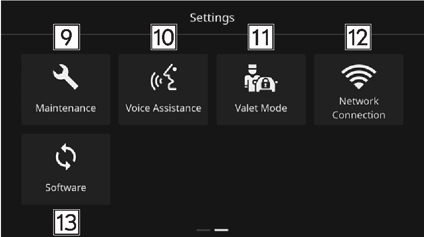
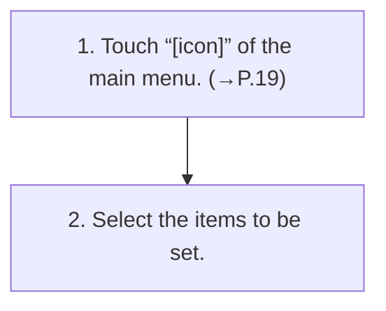

<!-- GENERATED:START function=e0f9d8f184e3 (generated; edits inside this block are overwritten by the next publish — write your own notes outside it) -->
# 1. Displaying the settings screen

<b>Function path:</b> Settings / Displaying the settings screen <b>Source:</b> printed page 40, 41 <b>Test-ready:</b> yes — no unfilled thresholds and a procedure is present

Every "Presumed requirement" row below is machine-derived from the Owner's Manual text by rule-based extraction — not AI-written — and traceable to the printed page in its Source column.

## Figures (areas of the original PDF; the OM has no figure numbers or captions)

- Figure 1-1 source: p.40
- (Copied from OM) Select to display the sound settings screen. (→P.41)

- Figure 1-2 source: p.40
- (Copied from OM) Select to display the sound settings screen. (→P.41)

## Procedure

| Seq | Step | Operation (Copied from OM) | Source |
|---|---|---|---|
| 1 | 1 | Touch “[icon]” of the main menu. (→P.19) | p.40 / step |
| 2 | 2 | Select the items to be set. | p.40 / step |

## 1-2-1. Service overview

| # | Presumed requirement | Strength | Source |
|---|---|---|---|
| 1 | Displaying the settings screenSelect to display the sound settings screen. (→P.41). | capability | p.40 / text |
| 2 | Displaying the settings screenSelect to display the driver profiles settings screen. Refer to the vehicle Owner’s Manual for details. | capability | p.40 / text |
| 3 | Displaying the settings screenSelect to display the EyeSight/driving assistance settings screen. Refer to the Owner’s Manual supplement for the EyeSight system for details. | capability | p.40 / text |
| 4 | Displaying the settings screenDisplay the manage devices screen. (→P.44). | capability | p.40 / text |
| 5 | Displaying the settings screenSelect to display the display settings screen. (→P.44). | capability | p.40 / text |
| 6 | Displaying the settings screenSelect to display the phone settings screen. (→P.45). | capability | p.40 / text |
| 7 | Displaying the settings screenSelect to display the vehicle settings screen. Refer to the vehicle Owner’s Manual for details. | capability | p.40 / text |
| 8 | Displaying the settings screenSelect to display the time/date settings screen. Refer to the vehicle Owner’s Manual for details. | capability | p.40 / text |
| 9 | Displaying the settings screenSelect to display the maintenance settings screen. Refer to the vehicle Owner’s Manual for details. | capability | p.40 / text |
| 10 | Displaying the settings screen“Wake Up Word: Hi SUBARU”: When this function is activated, say “Hi SUBARU” to activate the voice assistance function. | constraint | p.40 / text |
| 11 | Displaying the settings screenSelect to display the valet mode settings screen. Refer to the vehicle Owner’s Manual for details. | capability | p.41 / text |
| 12 | Displaying the settings screenSelect to display the network connection settings screen. (→P.47). | capability | p.41 / text |
| 13 | Displaying the settings screenSelect to display the software settings screen. (→P.48). | capability | p.41 / text |
<!-- GENERATED:END function=e0f9d8f184e3 -->

