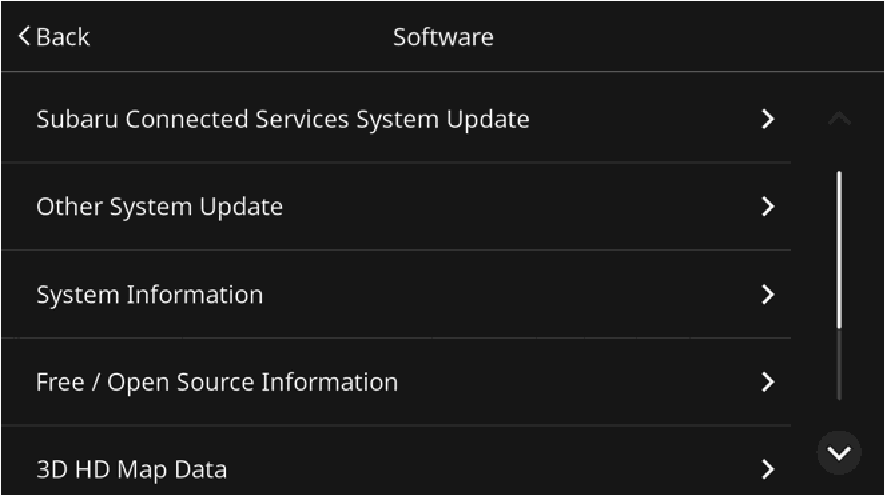
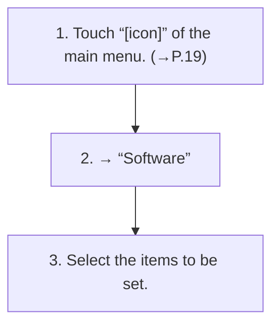

<!-- GENERATED:START function=70a5c8b94926 (generated; edits inside this block are overwritten by the next publish — write your own notes outside it) -->
# 10. Software settings screen

<b>Function path:</b> Settings / Software settings screen <b>Source:</b> printed page 48, 49 <b>Test-ready:</b> yes — no unfilled thresholds and a procedure is present

Every "Presumed requirement" row below is machine-derived from the Owner's Manual text by rule-based extraction — not AI-written — and traceable to the printed page in its Source column.

## Figures (areas of the original PDF; the OM has no figure numbers or captions)

- Figure 10-1 source: p.48
- (Copied from OM) 3. Select the items to be set.

## Procedure

| Seq | Step | Operation (Copied from OM) | Source |
|---|---|---|---|
| 1 | 1 | Touch “[icon]” of the main menu. (→P.19) | p.48 / step |
| 2 | 2 | → “Software” | p.48 / step |
| 3 | 3 | Select the items to be set. | p.48 / step |

## 10-2-1. Service overview

| # | Presumed requirement | Strength | Source |
|---|---|---|---|
| 1 | Software settings screen“Subaru Connected Services System Select to display the Subaru connected services system Update” update screen. (→P.49). | capability | p.48 / text |
| 2 | Software settings screenSelect to display the vehicle’s systems other than the “Other System Update” Subaru connected services system update screen. (→P.50). | capability | p.48 / text |
| 3 | Software settings screen“System Information” Select to display the system information. | capability | p.48 / text |
| 4 | Software settings screen“Free/Open Source Information” Select to display the free/open source software information. | capability | p.48 / text |
| 5 | Software settings screenSelect to display the version of the 3D high definition map data. “3D HD Map Data”* Refer to the Owner’s Manual supplement for the Eye- Sight system for details. | capability | p.48 / text |
| 6 | Software settings screenSelect to enable/disable the services using the cloud navigation server. | capability | p.48 / text |

## 10-2-2. Service requirements

| # | Presumed requirement | Strength | Source |
|---|---|---|---|
| 1 | Step -To use the services using the cloud navigation server, “Location Based Cloud Services”* it is necessary to enable the setting. | capability | p.48 / bullet |
| 2 | Step -When the services using the cloud navigation server are not to be used, disable the settings, check the message displayed and then touch “Continue”. | capability | p.48 / bullet |
| 3 | Software settings screen“Reset”: Select to reset all setup items. The audio system restarts automatically after resetting factory data. “Factory Data Reset” To complete the reset process, turn the ignition switch to OFF after the audio system has restarted, and then turn to ACC or ON after approximately 3 minutes. | capability | p.48 / text |
| 4 | Software settings screen*: If equipped. | constraint | p.49 / text |
<!-- GENERATED:END function=70a5c8b94926 -->

