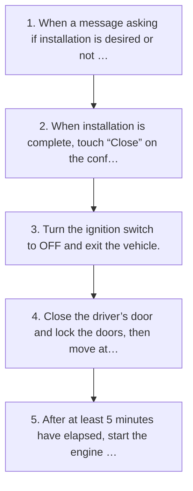

<!-- GENERATED:START function=da4a9da87eda (generated; edits inside this block are overwritten by the next publish — write your own notes outside it) -->
# 16. Update installation

<b>Function path:</b> Settings / Update installation <b>Source:</b> printed page 51 <b>Test-ready:</b> yes — no unfilled thresholds and a procedure is present

Every "Presumed requirement" row below is machine-derived from the Owner's Manual text by rule-based extraction — not AI-written — and traceable to the printed page in its Source column.

## Procedure

| Seq | Step | Operation (Copied from OM) | Source |
|---|---|---|---|
| 1 | 1 | When a message asking if installation is desired or not is displayed, touch “Install | p.51 / step |
| 2 | 2 | When installation is complete, touch “Close” on the confirmation message. | p.51 / step |
| 3 | 3 | Turn the ignition switch to OFF and exit the vehicle. | p.51 / step |
| 4 | 4 | Close the driver’s door and lock the doors, then move at least 10 feet (3 m) away from the vehicle to prevent the key from interfering. | p.51 / step |
| 5 | 5 | After at least 5 minutes have elapsed, start the engine again. | p.51 / step |

## 16-2-2. Service requirements

| # | Presumed requirement | Strength | Source |
|---|---|---|---|
| 1 | Step -Park your vehicle in a safe place when installing the update. | constraint | p.51 / bullet |
| 2 | Step -The following system functions are restricted during the update installation. | capability | p.51 / bullet |
| 3 | Step -It will not be possible to use general system functions. 2. | capability | p.51 / bullet |
| 4 | Step -Only the rear view camera image will be displayed. Or the image will disappear temporarily. | capability | p.51 / bullet |
| 5 | Step -Installation will take several minutes. | capability | p.51 / bullet |
| 6 | Step -“Remind Me”: Select to extend the installation timing. | capability | p.51 / bullet |
| 7 | Step -The new software will be applied. | capability | p.51 / bullet |

## 16-5. Exception operation

| # | Presumed requirement | Strength | Source |
|---|---|---|---|
| 1 | Step -During software update installation, the screen may flicker. However, this is not a malfunction. | capability | p.51 / bullet |
| 2 | Step -If the update procedure fails, refer to the “Troubleshooting” section. (→P.156). | capability | p.51 / bullet |
<!-- GENERATED:END function=da4a9da87eda -->

