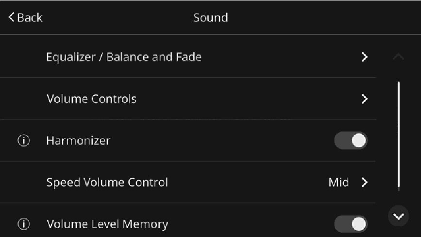
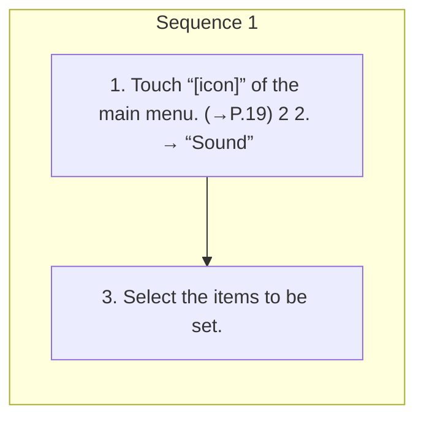

<!-- GENERATED:START function=26c4d1ead423 (generated; edits inside this block are overwritten by the next publish — write your own notes outside it) -->
# 2. Sound settings screen

<b>Function path:</b> Settings / Sound settings screen <b>Source:</b> printed page 41, 42 <b>Test-ready:</b> yes — no unfilled thresholds and a procedure is present

Every "Presumed requirement" row below is machine-derived from the Owner's Manual text by rule-based extraction — not AI-written — and traceable to the printed page in its Source column.

## Figures (areas of the original PDF; the OM has no figure numbers or captions)

- Figure 2-1 source: p.41
- (Copied from OM) 3. Select the items to be set.

## Procedure

| Seq | Step | Operation (Copied from OM) | Source |
|---|---|---|---|
| 1 | 1 | Touch “[icon]” of the main menu. (→P.19) 2 2. → “Sound” | p.41 / step |
| 1 | 3 | Select the items to be set. | p.41 / step |

## 2-2-1. Service overview

| # | Presumed requirement | Strength | Source |
|---|---|---|---|
| 1 | Sound settings screenSelect to display the equalizer/balance and fade settings “Equalizer/Balance and Fade” screen. (→P.43, 43). | capability | p.41 / text |
| 2 | Sound settings screenSelect to display the volume controls settings screen. | capability | p.42 / text |

## 2-2-2. Service requirements

| # | Presumed requirement | Strength | Source |
|---|---|---|---|
| 1 | Step -“Navigation Guidance Volume”*1: Select to adjust the volume level of the voice guidance when the navigation system is used. | constraint | p.42 / bullet |
| 2 | Step -“System Notification Volume”*1: Select to adjust the volume level of sound notifications. | capability | p.42 / bullet |
| 3 | Step -“Touchscreen Beep”: Select to turn the beep sound on/off. | capability | p.42 / bullet |
| 4 | Step -“Touchscreen Beep Volume”: Select to adjust the volume level of beep sound. | capability | p.42 / bullet |
| 5 | Step -“Ringtone Volume”: Select to adjust the volume level of the ringtone when the hands-free phone system is used. | constraint | p.42 / bullet |
| 6 | Step -“Caller Voice Volume”: Select to adjust the volume level of your speaking voice when the hands-free phone system is used. | constraint | p.42 / bullet |
| 7 | Step -“In-Call Voice Volume”: Select to adjust the volume level of the interlocutor’s voice when the hands-free phone system is used. | constraint | p.42 / bullet |
| 8 | Step -“Voice Assistance Volume”: Select to adjust the volume level of the voice guidance when the voice assistance system is used. | constraint | p.42 / bullet |
| 9 | Sound settings screenSelect to enable/disable the function. When enabled, high-pitched sound is compensated to “Harmonizer”*2 compressed music files, allowing a playback at a similar sound quality level of the original sound before compression. | constraint | p.42 / text |
| 10 | Sound settings screenSelect to set the speed volume. The system adjusts to the optimum volume and tone Control”*2 quality according to vehicle speed to compensate for “Speed Volume increased vehicle noise. On vehicles with a Harman/Kardon® audio system, this function is constantly enabled. | capability | p.42 / text |
| 11 | Sound settings screenSelect to enable/disable the function. When enabled and when the ignition switch is turned “Volume Level Memory” from OFF to ACC/ON, the volume level of the audio source last used will be recalled. | constraint | p.42 / text |
| 12 | Sound settings screen*1: If equipped *2: Not displayed on vehicles with a Harman/Kardon® audio system. | constraint | p.42 / text |

## 2-5. Exception operation

| # | Presumed requirement | Strength | Source |
|---|---|---|---|
| 1 | Step -“Safety Warning Volume”: Select to adjust the warning volume level. Refer to the vehicle Owner’s Manual for “Volume Controls” details. | capability | p.42 / bullet |
<!-- GENERATED:END function=26c4d1ead423 -->

