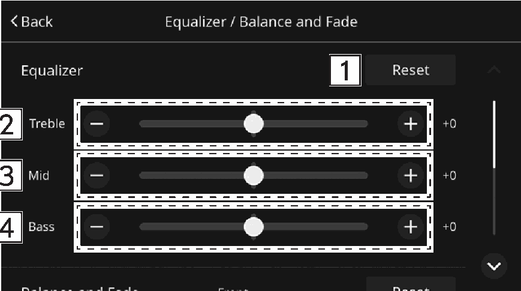

<!-- GENERATED:START function=de4f4a203b7a (generated; edits inside this block are overwritten by the next publish — write your own notes outside it) -->
# 3. Equalizer settings

<b>Function path:</b> Settings / Equalizer settings <b>Source:</b> printed page 43 <b>Test-ready:</b> no — procedure missing or thresholds unfilled

Every "Presumed requirement" row below is machine-derived from the Owner's Manual text by rule-based extraction — not AI-written — and traceable to the printed page in its Source column.

## Figures (areas of the original PDF; the OM has no figure numbers or captions)

- Figure 3-1 source: p.43
- (Copied from OM) Select to reset all setup items.

## 3-2-1. Service overview

| # | Presumed requirement | Strength | Source |
|---|---|---|---|
| 1 | Equalizer settingsHow good an audio program sounds is largely determined by the mix of the treble, mid and bass levels. In fact, different kinds of music and vocal programs usually sound better with different mixes of treble, mid and bass. | capability | p.43 / text |
| 2 | Equalizer settingsSelect to reset all setup items. | capability | p.43 / text |
| 3 | Equalizer settingsSelect to adjust high-pitched tones. | capability | p.43 / text |
| 4 | Equalizer settingsSelect to adjust mid-pitched tones. | capability | p.43 / text |
| 5 | Equalizer settingsSelect to adjust low-pitched tones. | capability | p.43 / text |
<!-- GENERATED:END function=de4f4a203b7a -->

