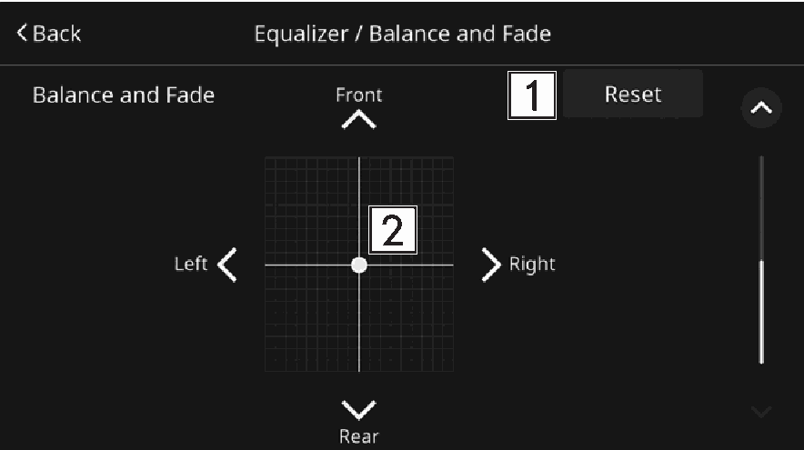

<!-- GENERATED:START function=6965bcaf7c57 (generated; edits inside this block are overwritten by the next publish — write your own notes outside it) -->
# 4. Balance/fader settings

<b>Function path:</b> Settings / Balance/fader settings <b>Source:</b> printed page 43, 44 <b>Test-ready:</b> no — procedure missing or thresholds unfilled

Every "Presumed requirement" row below is machine-derived from the Owner's Manual text by rule-based extraction — not AI-written — and traceable to the printed page in its Source column.

## Figures (areas of the original PDF; the OM has no figure numbers or captions)

- Figure 4-1 source: p.44
- (Copied from OM) Select to reset the adjusted position.

## 4-2-1. Service overview

| # | Presumed requirement | Strength | Source |
|---|---|---|---|
| 1 | Balance/fader settingsA good balance of the left and right stereo channels and of the front and rear sound levels is also important. | capability | p.43 / text |
| 2 | Balance/fader settingsKeep in mind that when listening to a stereo recording or broadcast, changing the right/left balance will increase the volume of 1 group of sounds while decreasing the volume of another. | constraint | p.43 / text |
| 3 | Balance/fader settingsSelect to reset the adjusted position. | capability | p.44 / text |
| 4 | Balance/fader settingsSelect the icon to adjust sound balance. | capability | p.44 / text |
<!-- GENERATED:END function=6965bcaf7c57 -->

