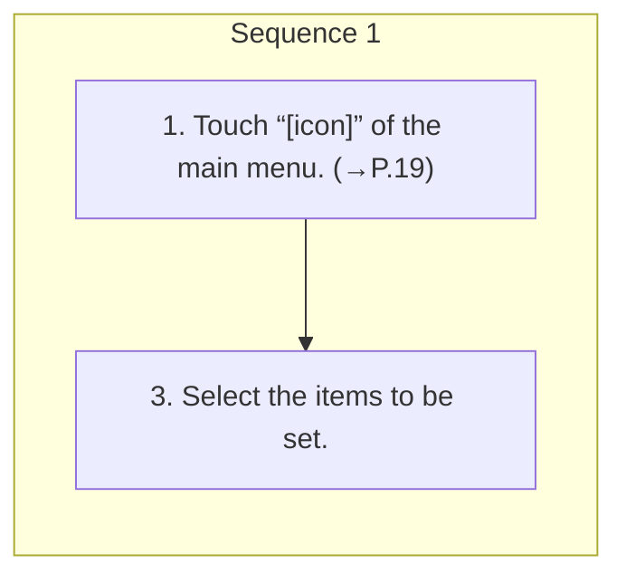

<!-- GENERATED:START function=c52baa2a8a2f (generated; edits inside this block are overwritten by the next publish — write your own notes outside it) -->
# 5. Manage devices settings screen

<b>Function path:</b> Settings / Manage devices settings screen <b>Source:</b> printed page 44 <b>Test-ready:</b> yes — no unfilled thresholds and a procedure is present

Every "Presumed requirement" row below is machine-derived from the Owner's Manual text by rule-based extraction — not AI-written — and traceable to the printed page in its Source column.

## Procedure

| Seq | Step | Operation (Copied from OM) | Source |
|---|---|---|---|
| 1 | 1 | Touch “[icon]” of the main menu. (→P.19) | p.44 / step |
| 1 | 3 | Select the items to be set. | p.44 / step |

## 5-2-1. Service overview

| # | Presumed requirement | Strength | Source |
|---|---|---|---|
| 1 | Manage devices settings screen2. → “Manage Devices”. | capability | p.44 / text |

## 5-2-2. Service requirements

| # | Presumed requirement | Strength | Source |
|---|---|---|---|
| 1 | Step -Registering a Bluetooth phone/device: →P.55. | capability | p.44 / bullet |
| 2 | Step -Connecting or disconnecting Bluetooth phones/devices: →P.57. | capability | p.44 / bullet |
| 3 | Step -Deleting Bluetooth phones/devices: →P.59. | capability | p.44 / bullet |
<!-- GENERATED:END function=c52baa2a8a2f -->

