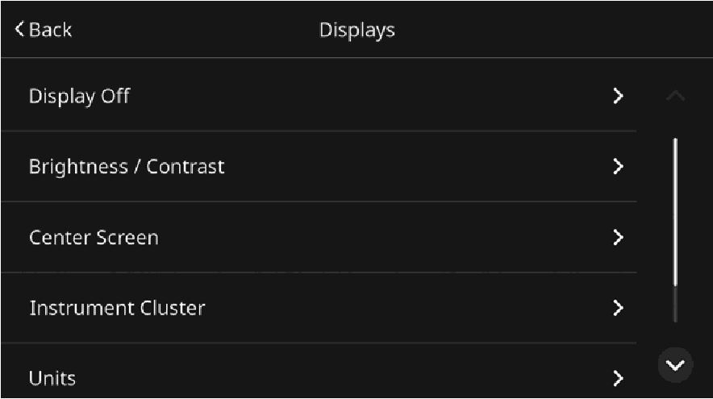
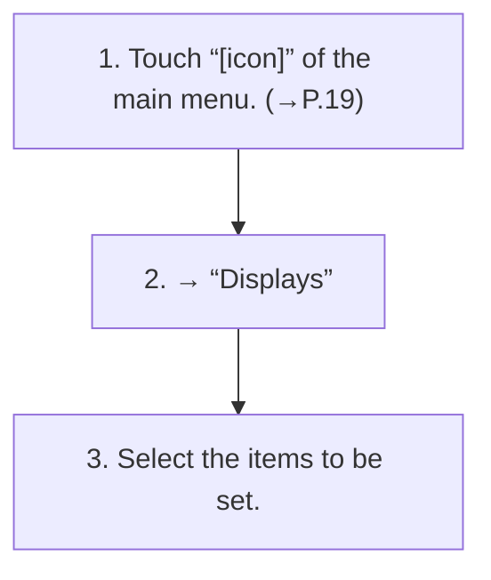

<!-- GENERATED:START function=214f9158e97a (generated; edits inside this block are overwritten by the next publish — write your own notes outside it) -->
# 6. Displays settings screen

<b>Function path:</b> Settings / Displays settings screen <b>Source:</b> printed page 44, 45 <b>Test-ready:</b> yes — no unfilled thresholds and a procedure is present

Every "Presumed requirement" row below is machine-derived from the Owner's Manual text by rule-based extraction — not AI-written — and traceable to the printed page in its Source column.

## Figures (areas of the original PDF; the OM has no figure numbers or captions)

- Figure 6-1 source: p.45
- (Copied from OM) 3. Select the items to be set.

## Procedure

| Seq | Step | Operation (Copied from OM) | Source |
|---|---|---|---|
| 1 | 1 | Touch “[icon]” of the main menu. (→P.19) | p.44 / step |
| 2 | 2 | → “Displays” | p.44 / step |
| 3 | 3 | Select the items to be set. | p.45 / step |

## 6-2-1. Service overview

| # | Presumed requirement | Strength | Source |
|---|---|---|---|
| 1 | Displays settings screen“Display Off” Refer to the vehicle Owner’s Manual for details. 2. | capability | p.45 / text |
| 2 | Displays settings screen“Brightness/Contrast” Refer to the vehicle Owner’s Manual for details. | capability | p.45 / text |
| 3 | Displays settings screen“Home Screen Settings”: Select to enter home screen “Center Screen” edit mode. (→P.23). | capability | p.45 / text |

## 6-2-2. Service requirements

| # | Presumed requirement | Strength | Source |
|---|---|---|---|
| 1 | Step -“Header Options”: Refer to the vehicle Owner’s Manual for details. | capability | p.45 / bullet |
| 2 | Step -“Display Mode”: Refer to the vehicle Owner’s Manual “Instrument Cluster” for details. | capability | p.45 / bullet |
| 3 | Step -“Route Guidance Alerts”*: Select to enable/disable a turn-by-turn pop-up display on the combination meter. | capability | p.45 / bullet |
| 4 | Displays settings screen“Units” Refer to the vehicle Owner’s Manual for details. | capability | p.45 / text |
| 5 | Displays settings screen“Language” Refer to the vehicle Owner’s Manual for details. | capability | p.45 / text |
| 6 | Displays settings screen*: If equipped. | constraint | p.45 / text |
<!-- GENERATED:END function=214f9158e97a -->

