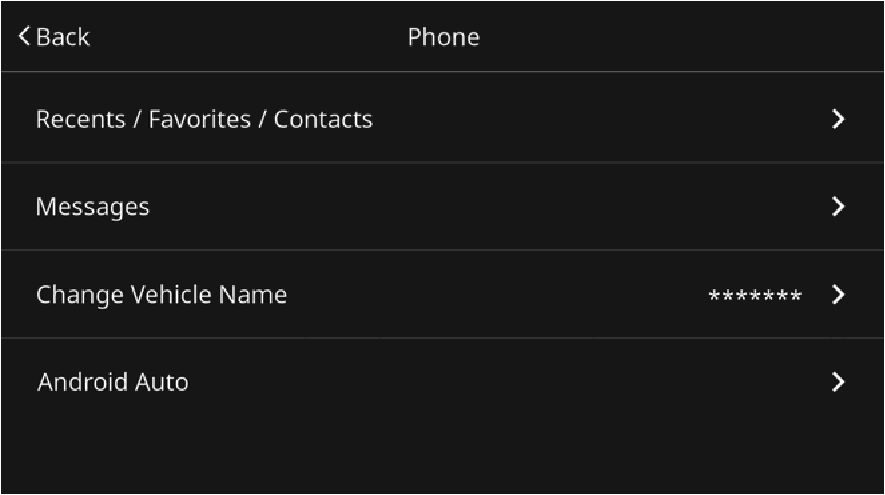
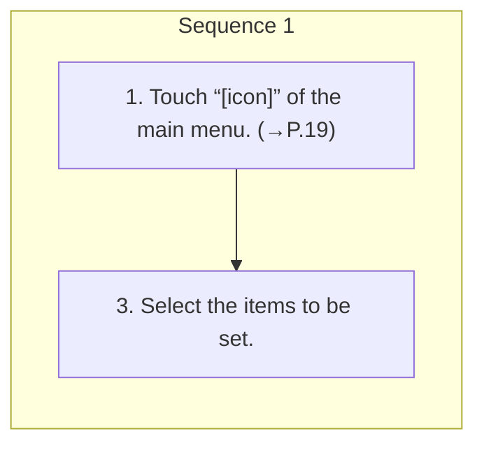

<!-- GENERATED:START function=450ed13667f8 (generated; edits inside this block are overwritten by the next publish — write your own notes outside it) -->
# 7. Phone settings screen

<b>Function path:</b> Settings / Phone settings screen <b>Source:</b> printed page 45, 46 <b>Test-ready:</b> yes — no unfilled thresholds and a procedure is present

Every "Presumed requirement" row below is machine-derived from the Owner's Manual text by rule-based extraction — not AI-written — and traceable to the printed page in its Source column.

## Figures (areas of the original PDF; the OM has no figure numbers or captions)

- Figure 7-1 source: p.46
- (Copied from OM) 3. Select the items to be set.

## Procedure

| Seq | Step | Operation (Copied from OM) | Source |
|---|---|---|---|
| 1 | 1 | Touch “[icon]” of the main menu. (→P.19) | p.45 / step |
| 1 | 3 | Select the items to be set. | p.46 / step |

## 7-2-1. Service overview

| # | Presumed requirement | Strength | Source |
|---|---|---|---|
| 1 | Phone settings screen2. → “Phone”. | capability | p.45 / text |

## 7-2-2. Service requirements

| # | Presumed requirement | Strength | Source |
|---|---|---|---|
| 1 | Step -“Sync”: When this function is activated, the history, favorites, phonebook of the connected Bluetooth phone will be synchronized with the system “Recents/Favorites/Contacts” automatically. | constraint | p.46 / bullet |
| 2 | Step -“Sort By Name”: The order of the list synchronized with the connected Bluetooth phone can be sorted by first name or last name. Select the desired sorting criteria. | capability | p.46 / bullet |
| 3 | Step -“Sync”: When this function is activated, the message function of the connected Bluetooth phone can be used on the system. | constraint | p.46 / bullet |
| 4 | Step -“Incoming Message Notifications”: When this function “Messages” is activated, the arrival of a new message will be notified via sound and a message on screen. | constraint | p.46 / bullet |
| 5 | Step -“Quick Replies”: Select to edit quick reply messages. (→P.47). | capability | p.46 / bullet |
| 6 | Phone settings screen“Change Vehicle Name” Select to change the vehicle name. | capability | p.46 / text |
| 7 | Phone settings screen“Wi-Fi Password”: Select to display current Wi-Fi® pass- “Android Auto” word. | capability | p.46 / text |
| 8 | Step -“Generate”: Generates a new password. | capability | p.46 / bullet |
| 9 | Step -Up to 2000 contacts can be downloaded and displayed on the phonebook screen. (Up to 5 phone numbers per contact will be downloaded.). | capability | p.46 / bullet |
| 10 | Step -Up to 50 favorites can be downloaded and displayed on the favorites screen. (Up to 5 phone numbers per favorite will be downloaded.). | capability | p.46 / bullet |
| 11 | Step -The notification setting on the Bluetooth phone may need to be activated in order to download the phonebook. For details, check the instructions for the connected Bluetooth phone. | capability | p.46 / bullet |

## 7-5. Exception operation

| # | Presumed requirement | Strength | Source |
|---|---|---|---|
| 1 | Step -The profile version of the connected Bluetooth phone may not be compatible with downloading phonebook data. For details, contact your SUBARU dealer. | capability | p.46 / bullet |
<!-- GENERATED:END function=450ed13667f8 -->

