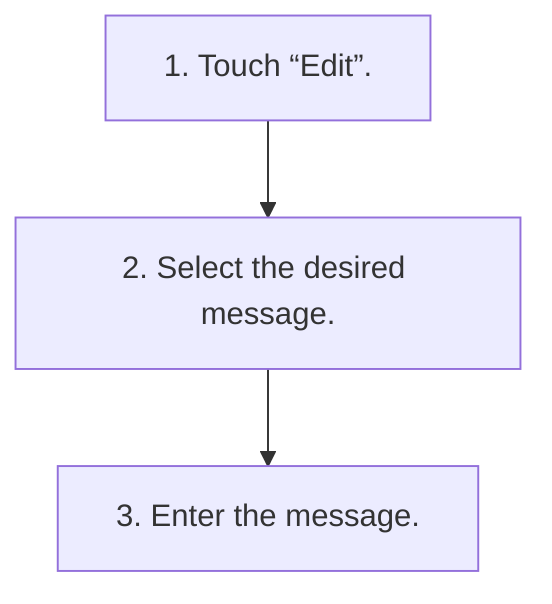

<!-- GENERATED:START function=f8e5422cfa46 (generated; edits inside this block are overwritten by the next publish — write your own notes outside it) -->
# 8. Editing the quick reply message

<b>Function path:</b> Settings / Editing the quick reply message <b>Source:</b> printed page 47 <b>Test-ready:</b> yes — no unfilled thresholds and a procedure is present

Every "Presumed requirement" row below is machine-derived from the Owner's Manual text by rule-based extraction — not AI-written — and traceable to the printed page in its Source column.

## Procedure

| Seq | Step | Operation (Copied from OM) | Source |
|---|---|---|---|
| 1 | 1 | Touch “Edit”. | p.47 / step |
| 2 | 2 | Select the desired message. | p.47 / step |
| 3 | 3 | Enter the message. | p.47 / step |

## 8-2-2. Service requirements

| # | Presumed requirement | Strength | Source |
|---|---|---|---|
| 1 | Step -“Add”: Select to add new message. | capability | p.47 / bullet |
| 2 | Step -“[icon]”: Select to delete the message. | capability | p.47 / bullet |
| 3 | Step -2 Before adding a new message, delete an already registered message. | capability | p.47 / bullet |
<!-- GENERATED:END function=f8e5422cfa46 -->

