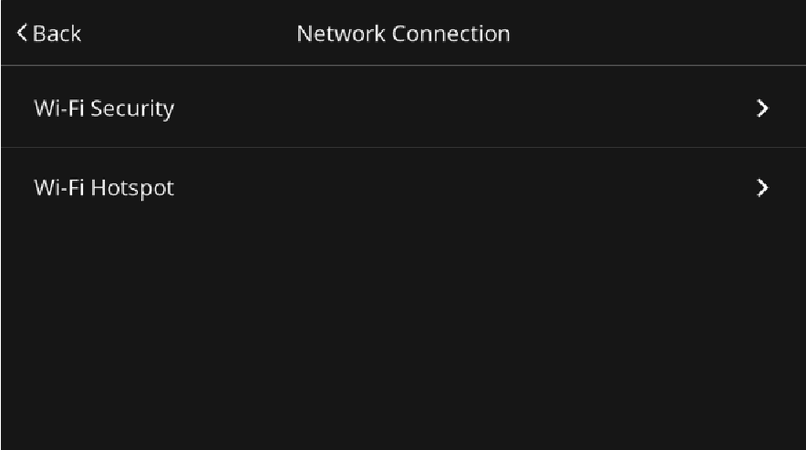
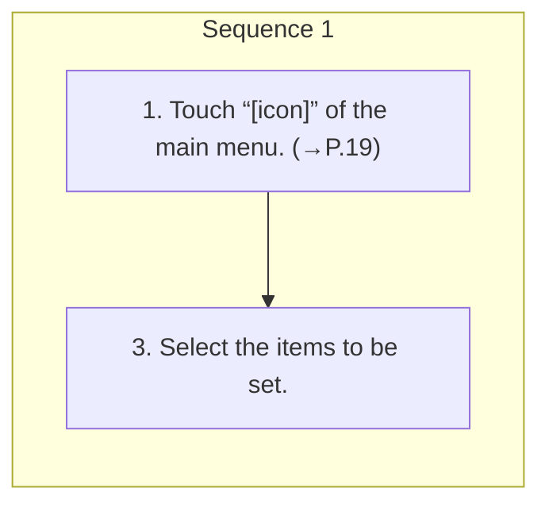

<!-- GENERATED:START function=fac4ff375d3b (generated; edits inside this block are overwritten by the next publish — write your own notes outside it) -->
# 9. Network connection settings screen

<b>Function path:</b> Settings / Network connection settings screen <b>Source:</b> printed page 47 <b>Test-ready:</b> yes — no unfilled thresholds and a procedure is present

Every "Presumed requirement" row below is machine-derived from the Owner's Manual text by rule-based extraction — not AI-written — and traceable to the printed page in its Source column.

## Figures (areas of the original PDF; the OM has no figure numbers or captions)

- Figure 9-1 source: p.47
- (Copied from OM) 3. Select the items to be set.

## Procedure

| Seq | Step | Operation (Copied from OM) | Source |
|---|---|---|---|
| 1 | 1 | Touch “[icon]” of the main menu. (→P.19) | p.47 / step |
| 1 | 3 | Select the items to be set. | p.47 / step |

## 9-2-1. Service overview

| # | Presumed requirement | Strength | Source |
|---|---|---|---|
| 1 | Network connection settings screen2. → “Network Connection”. | capability | p.47 / text |
| 2 | Network connection settings screen“Wi-Fi Settings for Software Select to set the Wi-Fi® function settings. (→P.59) Update/Map Update”*. | capability | p.47 / text |
| 3 | Network connection settings screenSelect to display Wi-Fi® security type that wireless Apple “Wi-Fi Security” CarPlay or wireless Android Auto uses. | capability | p.47 / text |
| 4 | Network connection settings screenSelect to set the Wi-Fi® Hotspot function settings. “Wi-Fi Hotspot”* Refer to the Owner’s Manual supplement for “MySubaru Connected Services” for details. | capability | p.47 / text |
| 5 | Network connection settings screen*: If equipped. | constraint | p.47 / text |
<!-- GENERATED:END function=fac4ff375d3b -->

