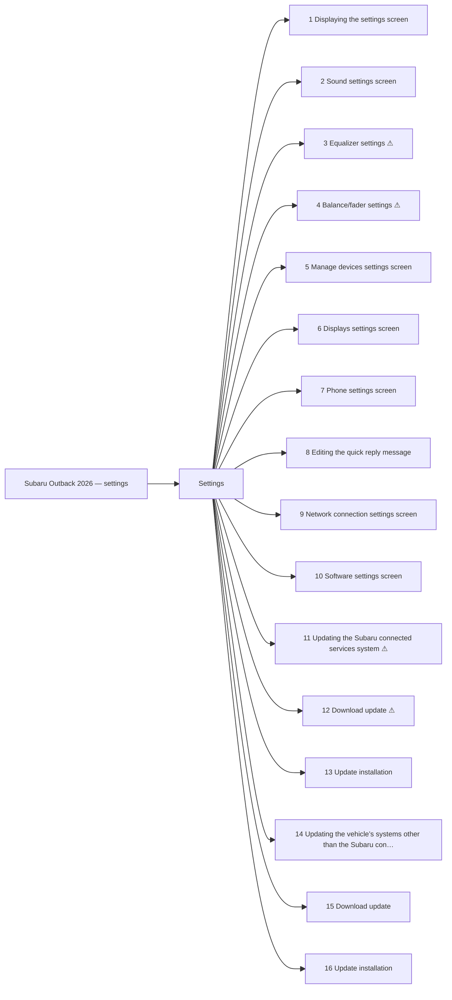

<!-- GENERATED:START index (generated; edits inside this block are overwritten by the next publish — write your own notes outside it) -->
# Subaru Outback 2026 — settings — Presumed specification

> This is a machine-derived estimate, not an official requirements document. Numeric thresholds left blank could not be found in the manual and must be filled in by a tester with evidence.

| Field | Value |
|---|---|
| Maker / Model | Subaru / Outback 2026 |
| Scope | settings |
| Markets | US, CA |
| Profile | subaru_v1 |
| Manual ID | subaru/outback-2026/ivi |

## Numeric thresholds

- Thresholds detected: **0**
- Filled: **0** / unfilled: **0**
- Test-ready functions: **11 / 16**

The manual states almost no numbers, so a tester fills the thresholds in. A function that still has an unfilled threshold cannot become a test specification (`is_test_ready=false`). Fill them in `overlay/thresholds.yaml` or on the screen.

```mermaid
pie showData
    "Filled" : 0
    "Unfilled" : 0
```

## Figures in the manual

- Figures: **9** / images rendered: **9**

Each image is a rendering of the corresponding area of the original PDF. **Images are not kept in the repository** (they are copies of another company's manual); `publish` creates them under `../figures/` on the machine that runs it.

## Glossary (registered by a reviewer)

How wording in the manual maps to the in-house term. **The original text is not rewritten** — the mapping is only annotated here. Register terms on the Glossary screen. Evidence (why the mapping holds) is required.

| In-house term | Category | Wording in the manual | Hits | Evidence |
|---|---|---|---:|---|
| AA | abbreviation | `Android Auto` | 2 | Counted by string match over workspace/subaru/**/published/*.md (2026-09-01): outback-2026 31 / outback-2025 24 / ascent-2026 1. Always printed in full ("Android Auto") — no abbreviated form appears in the manual text; "AA" is an in-house-only abbreviation. |

## Functions



| No. | Function | Area | Requirements | Figures | Unfilled thresholds | Test-ready |
|---|---|---|---|---|---|---|
| 1 | [Displaying the settings screen](/specifications/subaru/outback-2026/ivi/file/1-displaying-the-settings-screen.md?chapter=settings) | Settings | 13 | 2 | 0 | o |
| 2 | [Sound settings screen](/specifications/subaru/outback-2026/ivi/file/2-sound-settings-screen.md?chapter=settings) | Settings | 15 | 1 | 0 | o |
| 3 | [Equalizer settings](/specifications/subaru/outback-2026/ivi/file/3-equalizer-settings.md?chapter=settings) | Settings | 5 | 1 | 0 | - |
| 4 | [Balance/fader settings](/specifications/subaru/outback-2026/ivi/file/4-balance-fader-settings.md?chapter=settings) | Settings | 4 | 1 | 0 | - |
| 5 | [Manage devices settings screen](/specifications/subaru/outback-2026/ivi/file/5-manage-devices-settings-screen.md?chapter=settings) | Settings | 3 | 0 | 0 | o |
| 6 | [Displays settings screen](/specifications/subaru/outback-2026/ivi/file/6-displays-settings-screen.md?chapter=settings) | Settings | 9 | 1 | 0 | o |
| 7 | [Phone settings screen](/specifications/subaru/outback-2026/ivi/file/7-phone-settings-screen.md?chapter=settings) | Settings | 12 | 1 | 0 | o |
| 8 | [Editing the quick reply message](/specifications/subaru/outback-2026/ivi/file/8-editing-the-quick-reply-message.md?chapter=settings) | Settings | 3 | 0 | 0 | o |
| 9 | [Network connection settings screen](/specifications/subaru/outback-2026/ivi/file/9-network-connection-settings-screen.md?chapter=settings) | Settings | 4 | 1 | 0 | o |
| 10 | [Software settings screen](/specifications/subaru/outback-2026/ivi/file/10-software-settings-screen.md?chapter=settings) | Settings | 10 | 1 | 0 | o |
| 11 | [Updating the Subaru connected services system](/specifications/subaru/outback-2026/ivi/file/11-updating-the-subaru-connected-services-system.md?chapter=settings) | Settings | 4 | 0 | 0 | - |
| 12 | [Download update](/specifications/subaru/outback-2026/ivi/file/12-download-update.md?chapter=settings) | Settings | 2 | 0 | 0 | - |
| 13 | [Update installation](/specifications/subaru/outback-2026/ivi/file/13-update-installation.md?chapter=settings) | Settings | 9 | 0 | 0 | o |
| 14 | [Updating the vehicle’s systems other than the Subaru connected services system](/specifications/subaru/outback-2026/ivi/file/14-updating-the-vehicles-systems-other-than-the-subaru-connected-services-system.md?chapter=settings) | Settings | 5 | 0 | 0 | - |
| 15 | [Download update](/specifications/subaru/outback-2026/ivi/file/15-download-update.md?chapter=settings) | Settings | 4 | 0 | 0 | o |
| 16 | [Update installation](/specifications/subaru/outback-2026/ivi/file/16-update-installation.md?chapter=settings) | Settings | 9 | 0 | 0 | o |
<!-- GENERATED:END index -->


