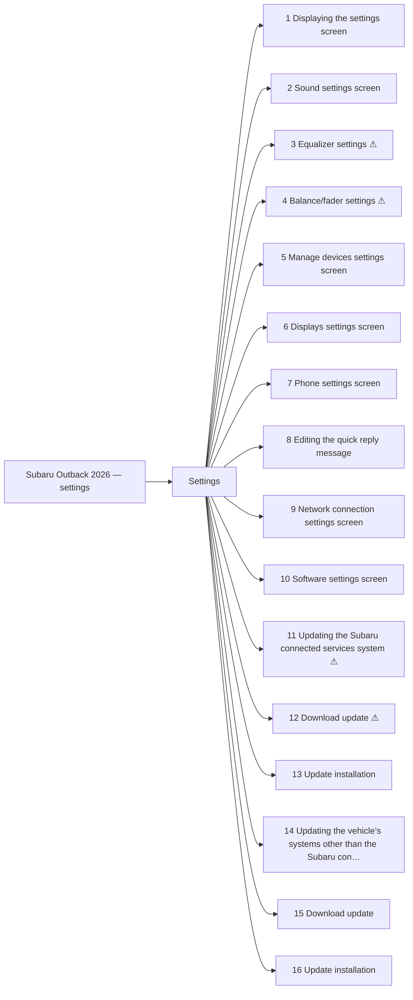

<!-- GENERATED:START index (generated; edits inside this block are overwritten by the next publish — write your own notes outside it) -->
# Subaru Outback 2026 — settings — Presumed specification

> This is a machine-derived estimate, not an official requirements document. Numeric thresholds left blank could not be found in the manual and must be filled in by a tester with evidence.

| Field | Value |
|---|---|
| Maker / Model | Subaru / Outback 2026 |
| Scope | settings |
| Markets | US, CA |
| Profile | subaru_v1 |
| Manual ID | subaru/outback-2026/ivi |

## Numeric thresholds
Filled: 0 / Unfilled: 0

```mermaid
pie showData
    "Filled" : 0
    "Unfilled" : 0
```

## Figures in the manual
9 figure area(s) detected.

## Functions



| No. | Function | Area | Requirements | Figures | Unfilled thresholds | Test-ready |
|---|---|---|---|---|---|---|
| 1 | Displaying the settings screen | Settings | 13 | 2 | 0 | o |
| 2 | Sound settings screen | Settings | 15 | 1 | 0 | o |
| 3 | Equalizer settings | Settings | 5 | 1 | 0 | - |
| 4 | Balance/fader settings | Settings | 4 | 1 | 0 | - |
| 5 | Manage devices settings screen | Settings | 3 | 0 | 0 | o |
| 6 | Displays settings screen | Settings | 9 | 1 | 0 | o |
| 7 | Phone settings screen | Settings | 12 | 1 | 0 | o |
| 8 | Editing the quick reply message | Settings | 3 | 0 | 0 | o |
| 9 | Network connection settings screen | Settings | 4 | 1 | 0 | o |
| 10 | Software settings screen | Settings | 10 | 1 | 0 | o |
| 11 | Updating the Subaru connected services system | Settings | 4 | 0 | 0 | - |
| 12 | Download update | Settings | 2 | 0 | 0 | - |
| 13 | Update installation | Settings | 9 | 0 | 0 | o |
| 14 | Updating the vehicle’s systems other than the Subaru connected services system | Settings | 5 | 0 | 0 | - |
| 15 | Download update | Settings | 4 | 0 | 0 | o |
| 16 | Update installation | Settings | 9 | 0 | 0 | o |
<!-- GENERATED:END index -->


